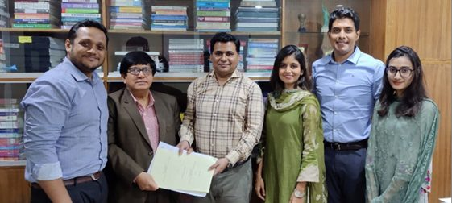

*CodersTrust signing contract with Center for Project Management and Information Systems (PMIS) University of Dhaka in collaboration with Bangladesh Computer Council (BCC) under ICT and Telecommunication Ministry, Bangladesh*

## OBJECTIVE

The project will improve cybersecurity, build resiliency during future crisis, and will enable the government to operate virtually to deliver critical public services to citizens and businesses. The project will create 100,000 jobs, with special focus on women, and train 100,000 youth in digital and disruptive technologies. To reduce vulnerabilities from the pandemic and prepare for the Fourth Industrial Revolution, the project will also help to digitalize small and medium enterprises and strategic industries.

## SCOPE

CodersTrust will provide training to 1000 youths on digital and disruptive 4IR technologies.
