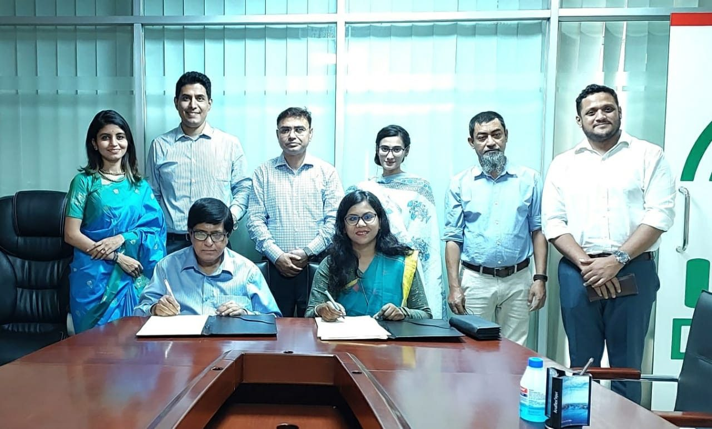

CodersTrust signing contract with Department of Information and Communication Technology (DoICT), ICT and Telecommunication Ministry, Bangladesh

## OBJECTIVE

The objective of this project is to establish a framework and ecosystem that will create a platform and train and facilitate 25,125 women in becoming professionals and entrepreneurs in the field of information and communication technology (ICT). Those smart women entrepreneurs would be a ‘supportive’ force in building smart Bangladesh.

## SCOPE

CodersTrust will develop course curriculum, training manuals and mentorship guidelines for all the necessary competency areas required for the whole project and will conduct Training of Trainers (ToT) and women.
