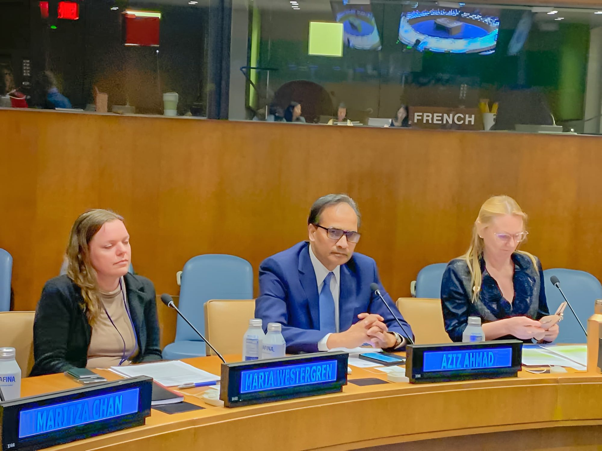

“We need to embrace all technology advancements with a clear understanding on digital good and digital bad and address the digital divide by reducing gaps in the society at large,” said Aziz Ahmad, Co-Founder and Chairman CodersTrust and CEO of UTC Associates, Inc. at a recent technology seminar held at the United Nations in New York City.

Aziz Ahmad is a globally renowned technology innovator, entrepreneur, and speaker. He recently presented at a seminar on “Data Collection and Distribution Process as Enablers for the Exercise of Human Rights” held at United Nations Headquarters in New York organized by the United Nations University for Peace as a side event in observance of World Press Freedom Day 2023.

Peace and prosperity can be ensured by enhancing the technology skills among the youths so that they can become the resources instead of becoming the burden of the society, Ahmad underscored.

The Bangladeshi-American technology investor joined the discussion with Jayashri Wyatt, Chief of the Education Outreach Section, Outreach Division, Department of Global Communications, United Nations, Amy Larsen, Director, Strategy and Management at Democracy Forward, Microsoft, Dr. Chris Wiggins, Chief Data Scientist, New York Times and Professor at the Data Science Institute, Columbia University and Dr. Mona Sloane, Senior Research Scientist & Associate Professor, NYU Center for Responsible AI as the panellists.

Renowned UN diplomat and communication expert Ramu Damodaran moderated the seminar while Juan Carlos Sainz Borgo, Vice President of the University for Peace, was in the chair.

The speakers emphasized their concern about the spread of hate speech and privacy violations in the name of technological advancement.

“I think we should embrace the technology innovation over innovation but need to ensure a balance in terms of freedom of speech and access to information and see how we can come up with the policy to address the bad elements and bad actors like hackers, even the country sponsored hackers, in the arena of digital technology,” said Ahmad.

In the wake of severe underemployment, and unemployment across the Globe, Ahmad founded CodersTrust to provide relevant skill sets among youth so that they can earn a living from the global market from anywhere they live, he informed the seminar.

The seminar lauded Ahmad for the incredible work of his organization, CodersTrust. Ahmad shared his experience as a Lead Architect of AT&T once for its 21st Century Network and said some of those technologies still remain while some are now gone. His discussion touched on important points such as the fact that 45 percent of today’s workforces needs to be re-skilled and up-skilled to stay relevant.

Discussion also centered around how artificial intelligence and automation are diversifying quickly. Billions of people still do not have the access to these technologies, and they are not generating any data, which creates the need to develop innovative approaches to embracing “digital good” and avoiding “digital bad.”

Ahmad also expressed his desire to regulate hate speech and propaganda, acknowledging the important balance between freedom of speech and keeping “digital good” in consideration.

“A very loose framework can be initiated where we can balance our innovations with ethics and compliance bringing rich and poor, men and women and different genders, our conscious, sub-conscious thoughts to mitigate the challenges of uncertain future,” said Ahmad.
