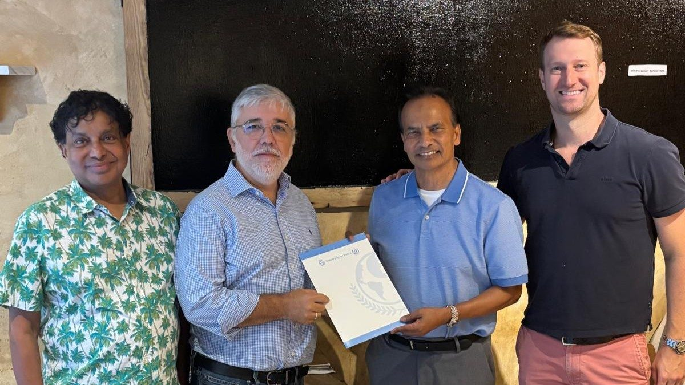

Dhaka, Bangladesh

CodersTrust proudly congratulates Aziz Ahmad, Co-Founder and Global Chairman of CodersTrust, on his appointment as a Global Ambassador of the University for Peace (UPEACE).

This prestigious appointment recognizes his longstanding commitment to creating opportunities for young people and advancing global peace through education, skills development, and economic empowerment.

Established by the UN General Assembly, the University for Peace is dedicated to promoting peace, understanding, and cooperation by providing education and empowering peacebuilders around the world. In his new role, Aziz Ahmad will contribute to this global mission while representing CodersTrust within the UPEACE network.

Throughout his leadership at CodersTrust, Aziz Ahmad has championed the belief that access to relevant skills and meaningful opportunities can empower individuals to transform their lives, strengthen their communities, and contribute to a more inclusive and peaceful world.

His appointment as a Global UPEACE Ambassador marks another significant milestone in this vision, highlighting the connection between youth empowerment, skills development, economic opportunity, and sustainable peace.

The CodersTrust family extends its heartfelt congratulations to Aziz Ahmad and takes immense pride in his achievement. His new responsibility is an inspiration to the entire organization and reflects the impact that purpose-driven leadership can have on communities and societies around the world.

CodersTrust looks forward to supporting this new chapter and contributing to initiatives that promote peace education, youth empowerment, skills development, and global collaboration.

Congratulations once again to Aziz Ahmad on this distinguished appointment.
