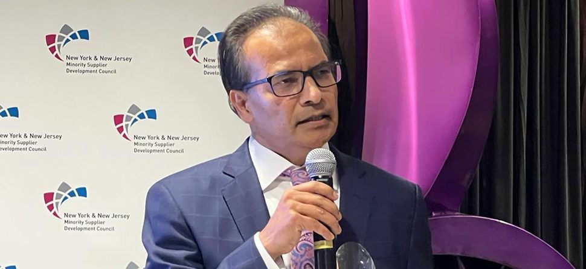

Aziz Ahmad, a renowned entrepreneur, Chairman of CodersTrust, Technology Architect, and philanthropist, has been honored with the esteemed Partnership Award presented by the New York New Jersey Minority Supplier Development Council (NYNJMSDC/the Council).

On Thursday, October 20, Ahmad was recognized for his outstanding achievements and contributions in the technology consulting field at an extravagant reception held in New York City. UTC Associates, the technology consulting company led by Ahmad, emerged as the top supplier in category two, surpassing 30 other nominees to secure the accolade.

For over three decades, NYNJMSDC has been hosting this annual award ceremony, which has become the coveted aspiration of numerous minority-owned businesses representing various ethnic communities.

Terrence Clark, President of NYNJMSDC, emphasized the importance of acknowledging businesses that not only deliver exceptional services to their clients but also foster local growth by creating employment opportunities in the community. The award highlights the notable efforts of businesses that contribute positively to their surroundings.

Ahmad, with his extensive experience in the information technology sector spanning more than two decades, has earned a commendable reputation for providing top-quality business solutions in the United States. The organizers praised his remarkable achievements and dedication to the industry during the citation before presenting him with the prestigious award.

Terrence Clark further elaborated on Ahmad’s significant impact, noting that he has not only expanded his technology services within the United States but has also extended his expertise to Bangladesh, spreading technological knowledge on a global scale. The impact of his business transcends borders and positively influences communities worldwide.

“With over 20 years of experience, Ahmad has transformed UTC into a leading provider of technology resources and solutions, earning a reputation as a trusted partner for organizations across a wide range of technical services,” remarked Terrence. A video presentation highlighting Ahmad’s work underscored his commitment to providing opportunities and improving lives, reflecting his guiding motto.

The NYNJMSDC Partnership Award recognizes Aziz Ahmad’s exceptional contributions to the IT industry and his unwavering dedication to fostering technological advancements that create a positive impact on individuals and communities alike.
