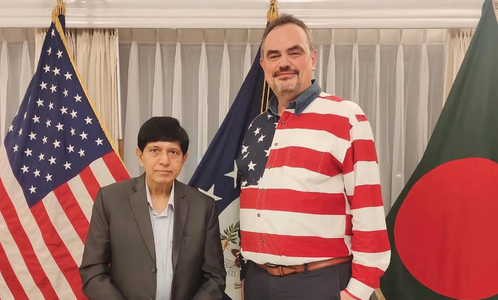
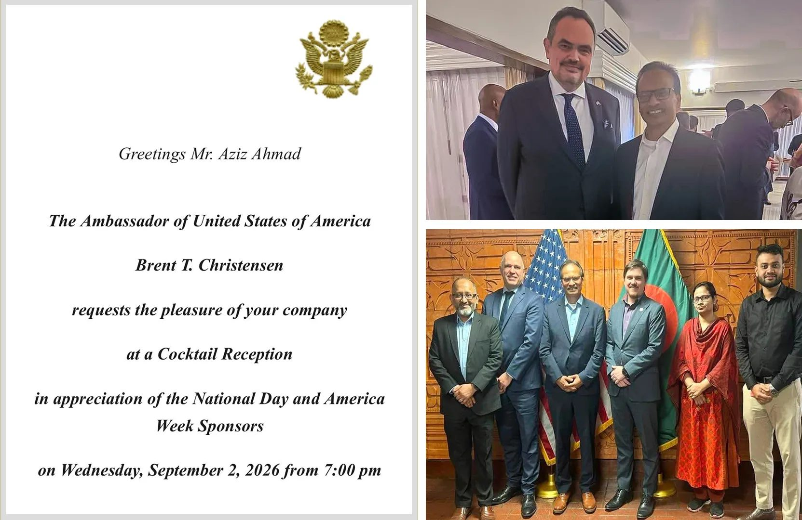

CodersTrust was proudly represented by CEO Md. Shamsul Haque, former Additional Secretary of the Ministry of Foreign Affairs, and his team at Ambassador Brent T. Christensen’s Cocktail Reception in appreciation of the National Day and America Week.
This moment builds on an incredible year of partnership with the Embassy – including our Great American Treasure Hunt, which lit up Dhaka with 1,400+ registered users and 15,000+ QR scans celebrating America’s 250th anniversary!

For details visit: [https://www.prweb.com/releases/us-embassy-dhaka-and-coderstrust-celebrate-a-successful-great-american-treasure-hunt-marking-americas-250th-anniversary-302839834.html](https://www.prweb.com/releases/us-embassy-dhaka-and-coderstrust-celebrate-a-successful-great-american-treasure-hunt-marking-americas-250th-anniversary-302839834.html)

None of this happens without our visionary Chairman, Aziz Ahmad, whose relentless drive continues to shape CodersTrust into a force for uplifting youths globally.

Grateful for this partnership, and excited for what’s next.
