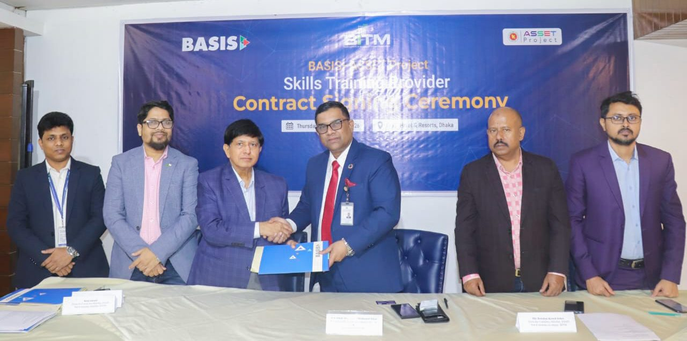
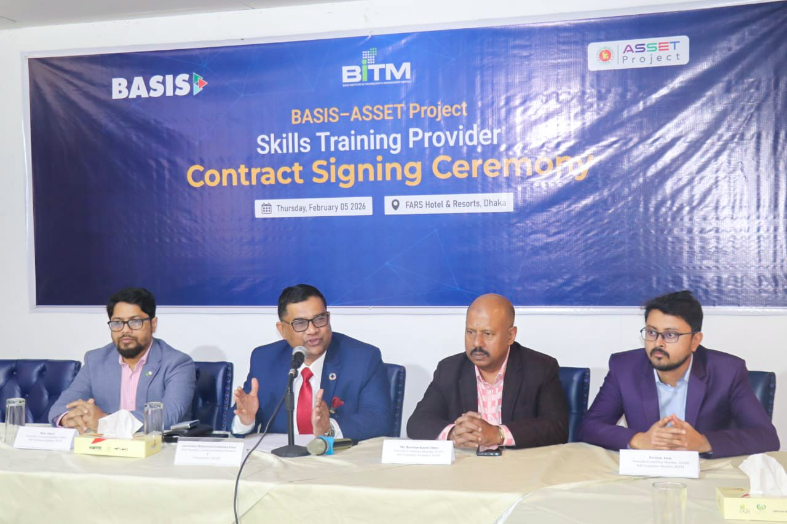

On February 5, 2026, CodersTrust officially became a training partner under the BASIS-ASSET project. This strategic partnership marks a major step forward in our mission to equip the youth of Bangladesh with world-class IT skills.

The CEO of CodersTrust, Md. Shamsul Haq, signed the agreement on behalf of CodersTrust. The signing ceremony was graced by the Administrator of BASIS, Mr. Abul Khair Mohammad Hafizullah Khan, Joint Secretary, Local Government Division, who signed on behalf of BASIS.

Through this partnership, CodersTrust aims to help establish Bangladesh as a global IT hub by fostering a strong digital ecosystem. Our focus is on bridging the skilled manpower gap by providing high-quality, industry-standard training.

CodersTrust continues to lead the technological revolution, creating new opportunities for the next generation. Together with BASIS, we are building a prosperous and digitally empowered tomorrow.
