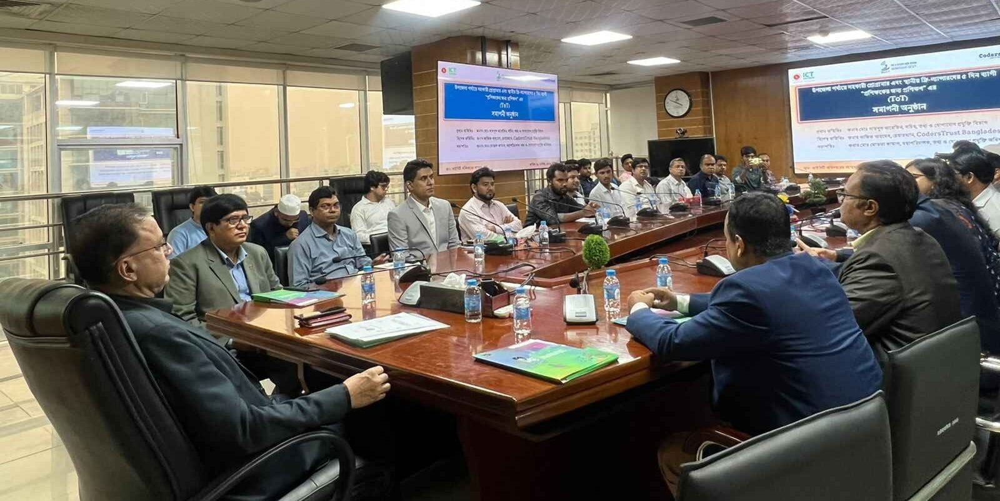
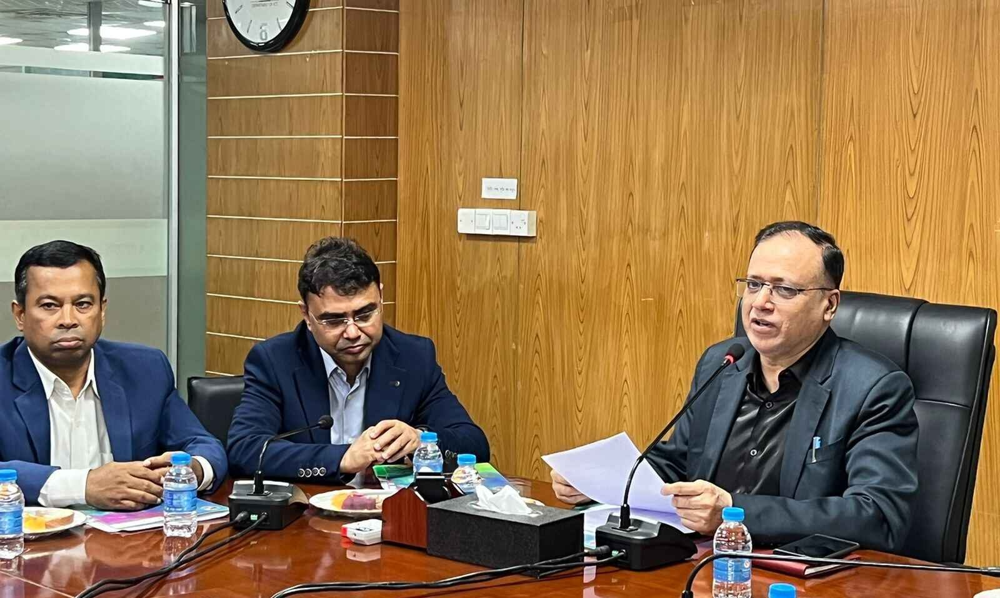
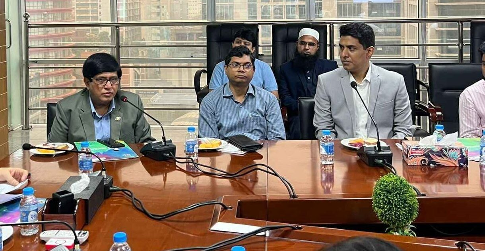
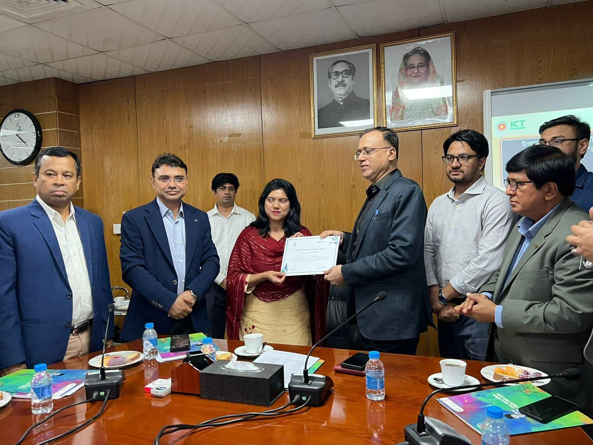

## Empowering the Digital Workforce: CodersTrust Bangladesh Successfully Concludes Training of Trainers (ToT) Program in Collaboration with DoICT

Dhaka, Bangladesh

CodersTrust has recently completed a transformative five-day Training of Trainers (ToT) program culminating in a successful collaboration with the Department of Information and Communication Technology (DoICT). This initiative, not only aligns with the visionary goals of Prime Minister Sheikh Hasina’s “Smart Bangladesh” vision but also emphasizes CodersTrust Bangladesh’s commitment to empowering trainers with essential skills for upcoming recruitment processes and the facilitation of impactful training sessions.

The formal closing ceremony was held on November 16th at The ICT Tower in Agargaon, Dhaka. The event was graced by the esteemed presence of Mr. Md Shamsul Arefin, Secretary of the Information and Communication Technology Division, Bangladesh, serving as the chief guest, with Mr. Md. Mostafa Kamal, Director General of DoICT, chairing the program. In this ceremonious event, trainers who successfully concluded the training sessions were privileged to receive certificates.

Mr. Md. Shamsul Arefin, Secretary of the Information and Communication Technology- ICT Division, emphasized the significance of training the trainers to facilitate knowledge transfer and foster capacity building. He thanked CodersTrust for its support and underscored the organization’s pivotal role in training the instructors.

“The cultivation of smart citizens is a cornerstone in the establishment of ‘Smart Bangladesh’. Recognizing the profound importance of training the trainers, I extend my appreciation to CodersTrust Bangladesh for its paramount role in shaping smart citizens. We are gratified to have found such a steadfast and dedicated partner in this transformative endeavor,” Mr. Arefin articulated.

“We are ready to invest our maximum efforts, leveraging our expertise and enthusiasm to guarantee the triumph of this significant project and make a transformative impact,” said Mr. Md. Shamsul Haque, CEO of CodersTrust.

He expressed his gratitude to the ICT division for choosing CodersTrust as a training partner in the process of building a Smart Bangladesh.

Participants expressed their appreciation for the program, highlighting the provision of invaluable guidance they received from the training.

Mossammat Sabina Yasmin, an Assistant Programmer from Savar, articulated the positive impact of the training. “The DoICT and CodersTrust Bangladesh training is invaluable for our future roles as trainers, instilling confidence and expertise. This comprehensive program enhances our proficiency, anticipating a smoother district-level recruitment process,” she said.

This collaborative effort signifies CodersTrust’s commitment to contributing significantly to the development of a Smart Bangladesh, fostering a culture of continuous learning, and empowering trainers for a more proficient and knowledgeable society.
