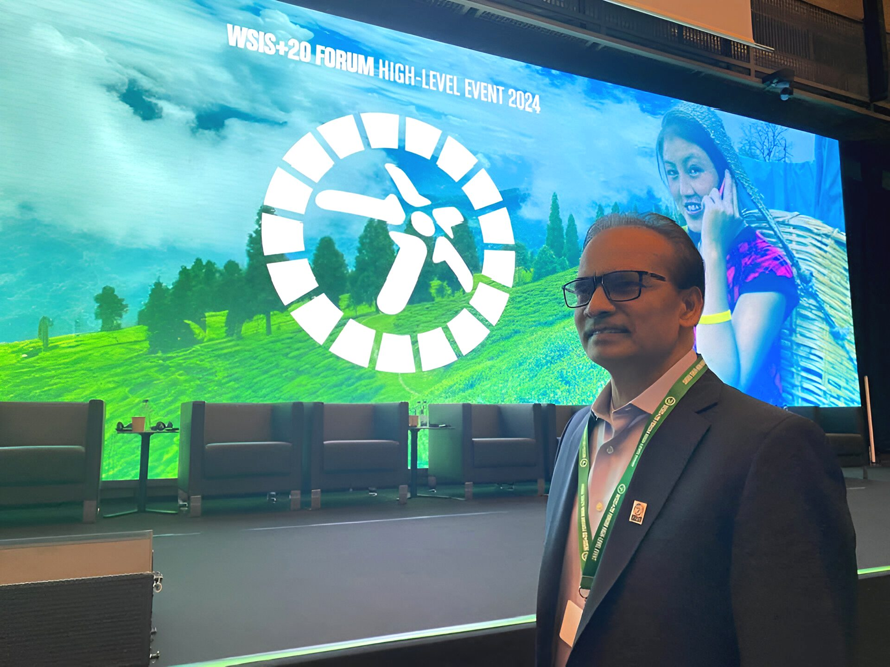
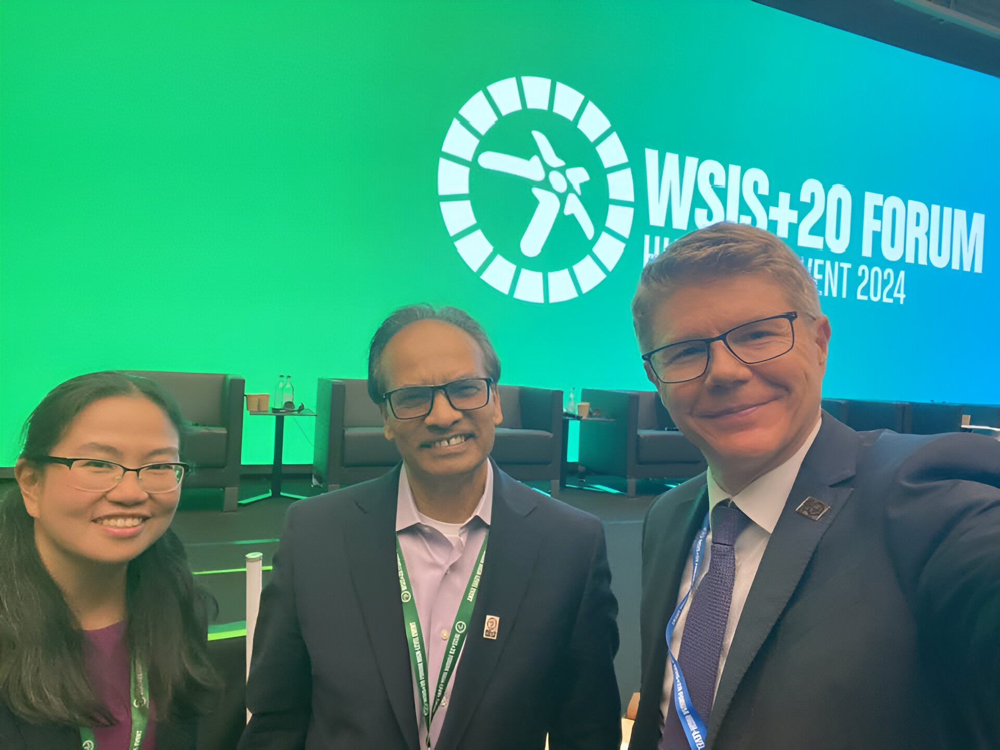

CodersTrust participates in the Technological Achievements and Global Recognition program of WSIS+20 Forum in Geneva

Geneva, Switzerland

CodersTrust participated in the World Summit on the Information Society (WSIS) in Geneva from May 27 to 31, 2024. This high-level event provided industry leaders, countries, and global organizations a platform to discuss the future of AI, IT, telecommunications, and digital governance. Aziz Ahmad, Chairman of CodersTrust, joined the event and engaged in meaningful dialogues on how to drive platform economies and ensure decent work for all, particularly in the Global South.

Speakers at the event emphasized the transformative potential of AI for the Global South, advocating for the closure of the digital divide and the promotion of emerging technologies. By embracing digital public goods and development-oriented technologies, the aim is to shape a future where 5.5 billion people are connected, striving to bridge the gap for the 2.6 billion individuals still offline.

The WSIS+20 Forum High-Level Event 2024 marks a significant milestone: twenty years of progress made in implementing the outcomes of the World Summit on the Information Society. The WSIS event highlighted the critical role of technological innovation in fostering a more inclusive and equitable digital future. CodersTrust is honored to be part of this global dialogue, continually striving to contribute to a Smart Bangladesh and beyond. We are committed to leveraging our expertise and resources to create a digitally inclusive world where everyone has the opportunity to thrive.

CodersTrust, a global EdTech company, is dedicated to fostering a skilled human workforce. We envision a future where millions of young individuals actively participate in the global job market or pursue entrepreneurship. Our goal is to assist in establishing a sustainable economic base by providing digital skills training in Bangladesh and on the global stage.

