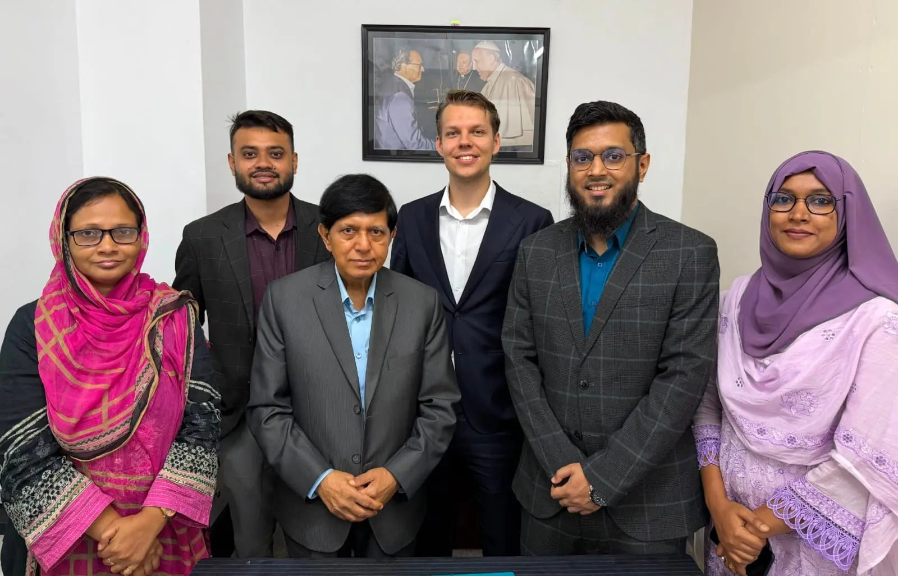

DHAKA, BANGLADESH — CodersTrust Bangladesh has officially signed a strategic Memorandum of Understanding (MoU) with RemoteIntegrity, a Florida-based US technology organization, marking a major milestone in driving global workforce inclusion for Bangladeshi tech talent.

The agreement was signed by Md. Shamsul Haque (CEO & Principal, CodersTrust Bangladesh) and Colin Koenig (CEO, RemoteIntegrity).

Through this strategic collaboration, CodersTrust aims to bridge the gap between local skill acquisition and international employment. Top-performing and qualified graduates will gain direct pathways into the global market through targeted placement initiatives, specialized readiness training, and client interview preparation aligned with international standards.

Talent is universal, even when opportunity isn’t. By partnering with RemoteIntegrity, we are taking our commitment to graduate success to the next level—connecting Bangladesh’s skilled workforce with high-value international careers.

This initiative reinforces CodersTrust’s founding mission to empower youth through high-demand digital skills and create sustainable career pathways in the global digital economy.
