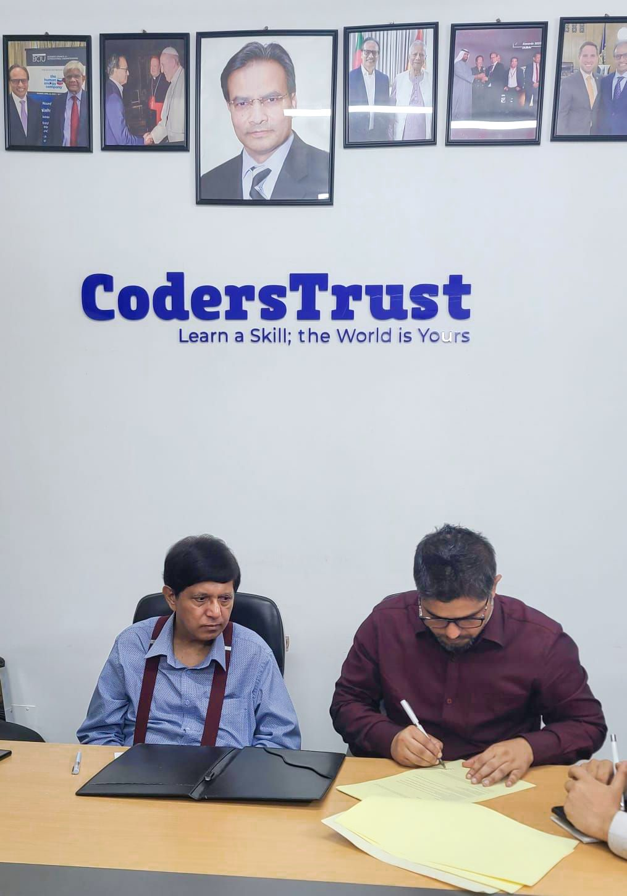

CodersTrust Bangladesh is proud to announce the signing of a strategic Memorandum of Understanding (MoU) with Base Study Concern, a renowned foreign education consultancy, visa advisory, and IELTS training organization.

On this momentous occasion, Md Shamsul Haque, CEO of CodersTrust Bangladesh, and Md Monayem Siddique, Co-Founder & CEO of Base Study Concern, formally signed the MoU on behalf of their respective organizations.

Also present at the occasion were Md Aminul Islam, Country Manager of CodersTrust Bangladesh; Md Rakib Ahmed from Base Study Concern; Rezaul Karim Khan, Chief Business Officer of CodersTrust Bangladesh, Rana Saha, Finance & Accounts Manager of CodersTrust Bangladesh along with other senior officials from both organizations.

What this partnership means for our students & alumni:

- One-stop solution for Study Abroad support
- Professional Visa Consultancy Services
- High-quality IELTS Preparation Courses
- Dedicated guidance to access global education opportunities

This collaboration marks a significant milestone in empowering CodersTrust learners and graduates with global pathways to education and career development. Together, we aim to unlock international prospects and strengthen Bangladesh’s presence in the global talent market.

We look forward to witnessing new journeys, ambitions, and success stories emerging from this partnership.
