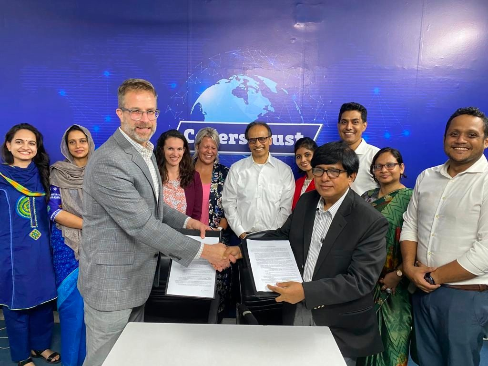

CodersTrust, a leading global EdTech company, is set to offer STEM (Science, Technology, Engineering and Mathematics) and Coding education for Bangladeshi learners under its SuperKids offering in collaboration with global leader of STEM Education, Discovery Education.

The organizations officially initiated the collaboration in Dhaka on Wednesday. Discovery Education’s Executive Director and SVP, Global Academic Consulting, Martin Creel, and CodersTrust Bangladesh CEO Md. Shamsul Haque signed in the presence of Aziz Ahmad, Chairman and Founder of CodersTrust, Emily Waters, International Senior Project Director of Discovery Education, Jeni Evans, Senior Director, of Educational Partnerships, CodersTrust Bangladesh Country Director, Ataul Goni Osmani and other officials of CodersTrust.

Discovery Education is the global leader in standards-based digital content for K-12, transforming teaching and learning with award-winning digital textbooks, multimedia content, professional development, and the largest professional learning community of its kind. Serving over 5 million educators and 50+ million students in over 100 countries, Discovery Education’s services are in half of U.S. classrooms, 50 percent of all primary schools in the U.K., and countries around the globe.

CodersTrust is a global EdTech-based digital workforce development and skill-oriented education provider that has trained 130,000+ youth since 2014 across 15 countries and territories, and is onboarding 1.5M+ National University learners. Through this collaboration, CodersTrust SuperKids will be offering Discovery Education’s world-class educational products to private, public and international schools, government, NGOs, and individual K-12 learners in Bangladesh.

Aziz Ahmad congratulated both Discovery Education and CodersTrust and termed it as a historic milestone for developing the next generation of Bangladesh as future-ready leaders and global citizens. “Looking forward to working closely together and making this collaboration a great success”, he said. Discovery Education’s Executive Director Martin Creel remarked, “Discovery Education is known for EduTech solutions from Coding to Math to Science and also STEM Connect across the globe. With this collaboration, we add Bangladesh to a world-wide network of teachers and learners. And we are so excited about it”.
