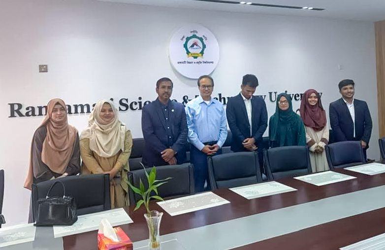
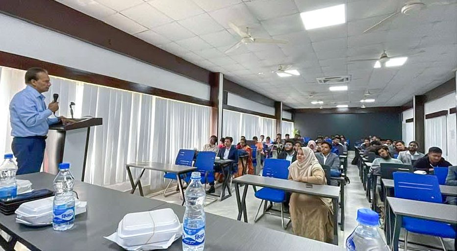
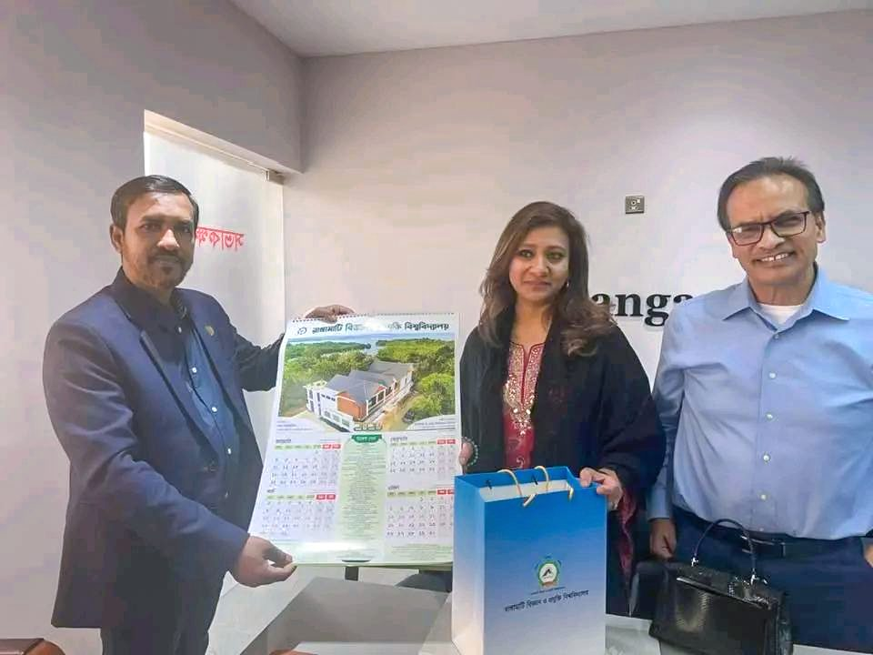

CodersTrust Chairman and Co-founder Aziz Ahmad is honored to be invited as the Keynote Speaker at Rangamati Science and Technology University (RMSTU), where he addresses graduating Computer Science students on the theme “Be Useful — The World Will Find You.”

In his keynote, Mr. Aziz Ahmad emphasizes the importance of building practical skills, staying curious, and creating meaningful value in a rapidly evolving global economy. He highlights how young professionals from Bangladesh can position themselves in the international workforce through continuous learning, adaptability, and a commitment to excellence.

Deep appreciation goes to Vice Chancellor Professor Atiar Rahman for his inspiring leadership and vision, and to Dr. Tauhidul Alam for seamlessly facilitating the program and creating a platform that connects students with industry insight and global perspectives.

CodersTrust’s mission remains clear to build skilled human capital and empower individuals with industry relevant training and global exposure. With the right opportunities and guidance, millions of young people from Bangladesh continue to move toward becoming part of the global workforce, creating sustainable livelihoods and contributing across international frontiers.

CodersTrust extends its best wishes to the graduating students as they begin their professional journeys. The future belongs to those who remain curious, skilled, and committed to creating value for the world.
