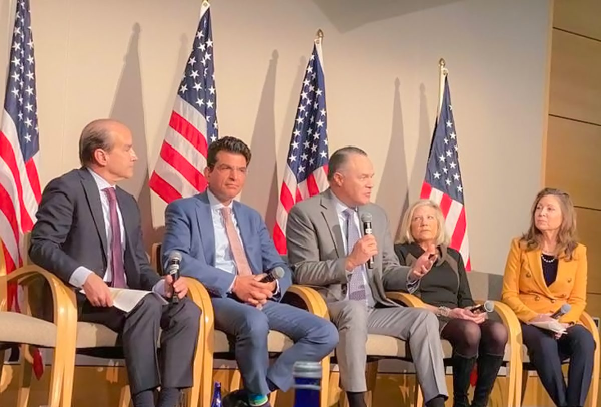
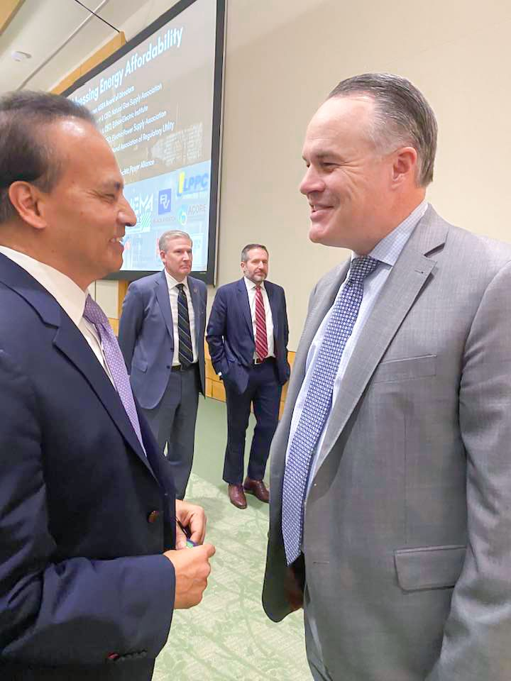
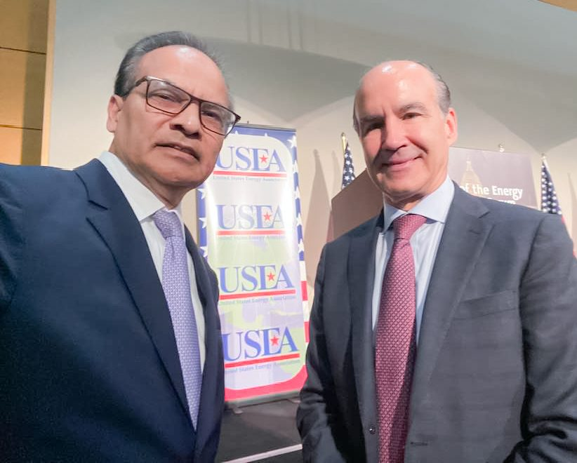

CodersTrust Chairman and Co-founder Aziz Ahmad attended the panel on “Advancing American Energy Security” led by the U.S. Secretary of Energy. The discussion highlighted the importance of energy resilience, affordability, innovation, and national priorities.

During the event, Mr. Aziz Ahmad exchanged insights with Mike Sommers, President of the American Petroleum Institute (API), on AI, data security, natural gas, resilient infrastructure, and the role of trusted platforms in strengthening energy systems.

CodersTrust continues to contribute to global conversations that drive innovation, sustainability, and secure energy solutions.
