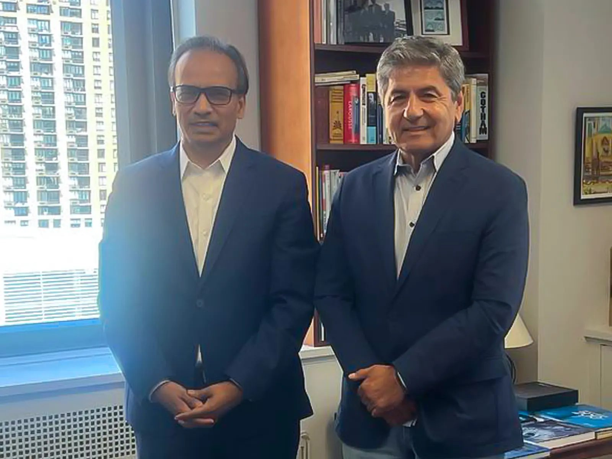

Aziz Ahmad, Chairman of CodersTrust and CEO of UTC Associates, recently visited City College Downtown, where he met with representatives to discuss opportunities for collaboration between CodersTrust and the Continuing and Professional Studies Program at the City College of New York (CCNY).

The meeting explored the possibility of making selected professional and career-focused courses available to an international audience through a potential partnership. The initiative could leverage Mr. Ahmad’s global connections and experience in workforce development to expand access to industry-relevant learning opportunities for learners beyond the United States.

Mr. Ahmad, an alumnus of CCNY, leads CodersTrust—a global workforce development and EdTech provider that has impacted over 80,000 learners and professionals across 2,300+ academic institutions in more than 15 countries. The organization specializes in digital skills development, ranging from K–12 STEM, coding, and robotics to advanced technical and business training for the digital economy.

The potential partnership aligns closely with CodersTrust’s core mission to empower underrepresented communities, particularly youth and women, by equipping them with market-relevant skills and connecting them to global career opportunities to foster financial independence.

As discussions progress, the proposed partnership could create new opportunities for knowledge sharing and international learning, bringing together CCNY’s continuing education offerings and CodersTrust’s global workforce development network.
