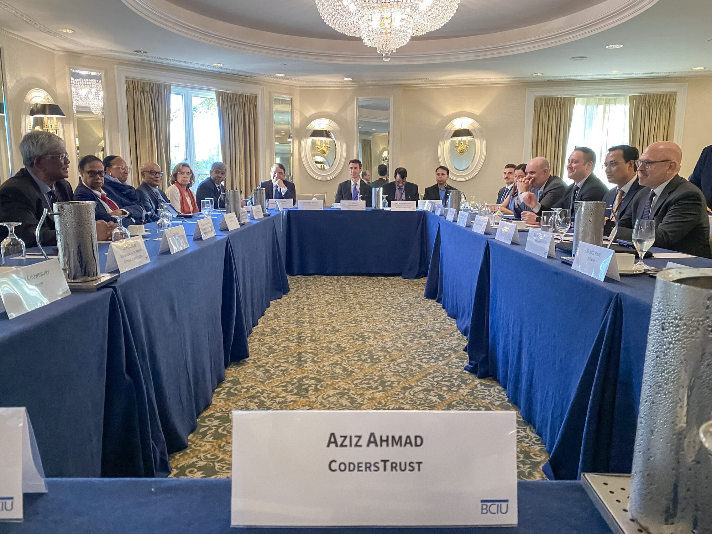

Mr. Aziz Ahmad, Chairman and Co-Founder of CodersTrust participated in the Business Council for International Understanding (BCIU) Roundtable in Washington, D.C., alongside Dr. Salehuddin Ahmed, Honorable Adviser to the Ministry of Finance, and Dr. Ahsan H. Mansur, Governor of Bangladesh Bank, during their visit to attend the World Bank meetings.

The roundtable discussion centered on strategies to better align Bangladesh’s development financing with digital skills advancement, youth empowerment, and innovation—identified as essential pillars for strengthening a resilient, knowledge-based economy.

During the event, Mr. Aziz Ahmad highlighted CodersTrust’s contributions since 2014, noting that the organization has trained 130,000+ youth across 15 countries and territories, helping build a smarter and more inclusive future.
