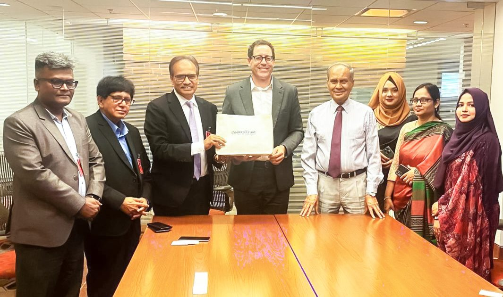

CodersTrust Chairman and Co-founder Mr. Aziz Ahmad led a seven-member delegation to the U.S. Embassy in Dhaka at the invitation of Mr. Paul Frost, Commercial Counselor. The meeting was described as highly engaging and productive, with Mr. Frost expressing strong interest in CodersTrust’s ongoing initiatives and impact.

Discussions focused on a shared commitment to empowering Bangladeshi youth through digital skills development, expanded global opportunities, and inclusive participation in the digital economy.

During the meeting, Mr. Ahmad outlined CodersTrust’s mission to address youth unemployment through comprehensive digital skills training. In response, Mr. Frost highlighted various U.S. initiatives aimed at equipping Bangladeshi youth with advanced technological skills and modern educational resources.

The dialogue represents a continued step toward strengthening global partnerships that support skills development and create brighter futures for Bangladesh’s young generation.
