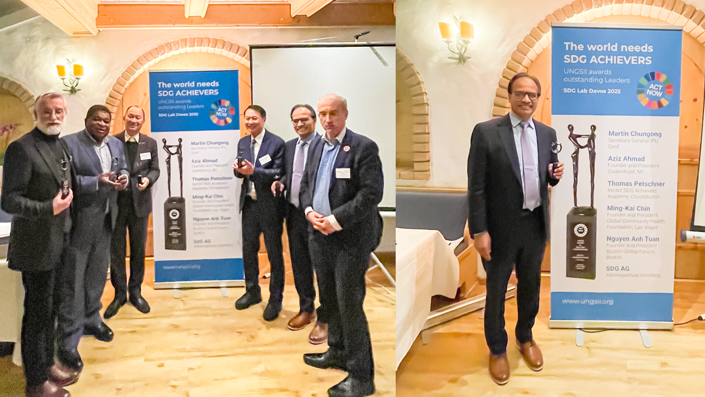

Mr. Aziz Ahmad, Chairman and Co-Founder of CodersTrust had the honor to accept the Lifetime SDG Achievement Award from the UNGSII during this momentous Davos WEF Week 2025. This recognition is a testament not only to the mission of CodersTrust but also to the collective power of education and skills development in driving progress across all 17 Sustainable Development Goals.

In his acceptance speech, Mr. Aziz honored the legacy of CodersTrust’s late co-founder, Ferdinand Kjærulff. A Danish captain with an extraordinary dream, Ferdinand envisioned a world where technology and education empower individuals to unlock their potential and rewrite their futures. While he is not with us today, his vision lives on in every life transformed by CodersTrust. This award is dedicated to his memory and his unwavering belief in the power of human potential.

Mr. Aziz expressed his heartfelt thanks to Roland Schatz and the leadership at SDG Labs for recognizing the crucial role education plays in advancing the SDGs. Education is the foundation upon which sustainable development is built, enabling individuals, communities, and nations to thrive.

Acknowledging the collective effort behind CodersTrust’s success, Mr. Aziz extended appreciation to colleagues across Bangladesh, the USA, and beyond. “Your commitment to excellence and tireless work are the driving forces behind our achievements,” said Mr. Aziz. “To our students around the world, your courage and determination inspire us to work harder, innovate more, and dream bigger.”

The award, described as both a milestone and a call to action, symbolizes the ongoing effort needed to ensure that education remains a cornerstone of sustainable development. “This recognition is not just for me but for all of us,” Mr. Aziz emphasized. “It reminds us that together, we can create a world where no dream is too far, no opportunity is unreachable, and every individual has the tools to build a better future.”

The honor serves as an inspiration for CodersTrust and its global community to continue advancing its mission of empowering individuals through education and technology, working towards a future where sustainable development is a reality for all.
