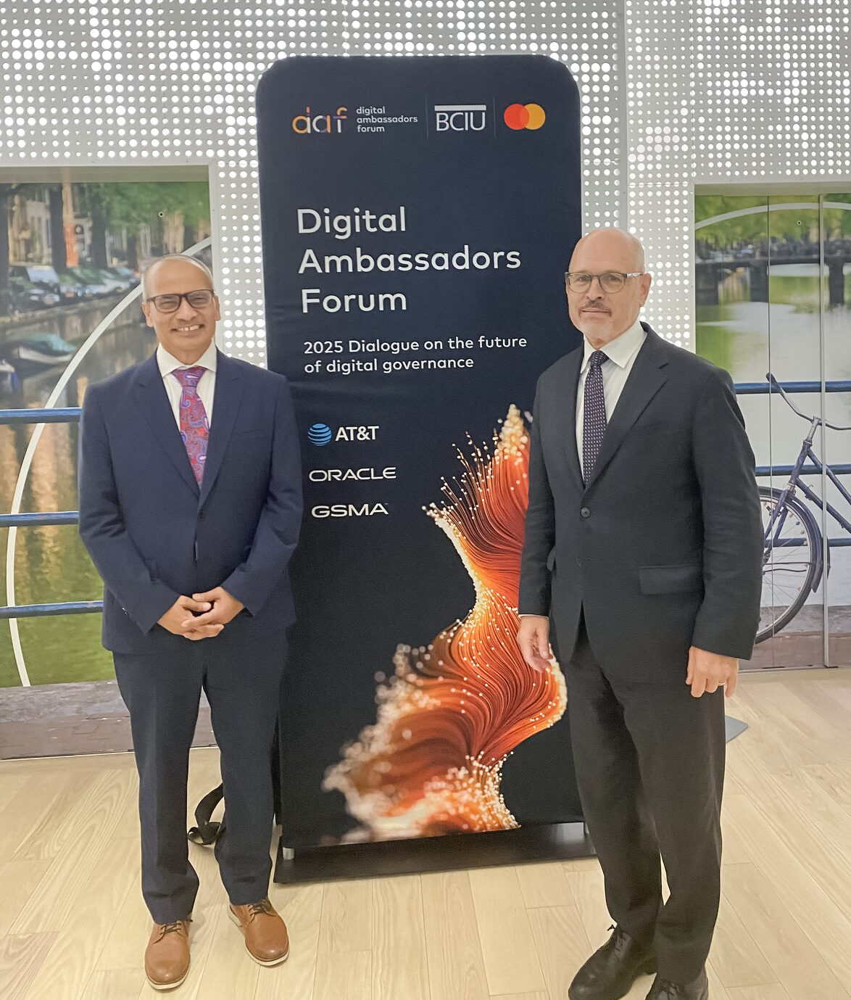
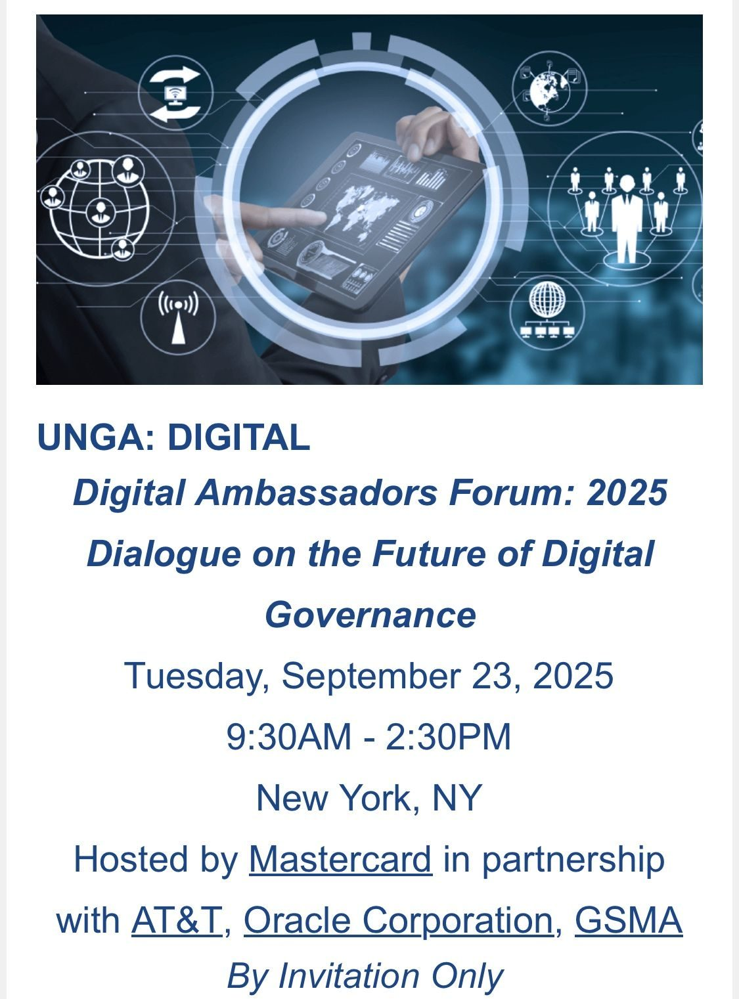

CodersTrust Chairman and Co-founder Mr. Aziz Ahmad participated in a high-level discussion on cybersecurity, digital governance, and the opportunities and risks of Artificial Intelligence during the United Nations General Assembly (UNGA) week in New York. The session was hosted by BCIU (Business Council for International Understanding) and Mastercard International.

Mr. Ahmad highlighted the growing potential of emerging nations such as Bangladesh and Nigeria to leverage advanced technologies for a safer, more inclusive digital future. He emphasized the importance of strategic collaboration, innovation, and strong governance frameworks in navigating the evolving AI landscape.

The discussion concluded with a shared sense of optimism and a commitment from participants to strengthen cooperation in the areas of cybersecurity, digital capacity building, and responsible technology adoption.
