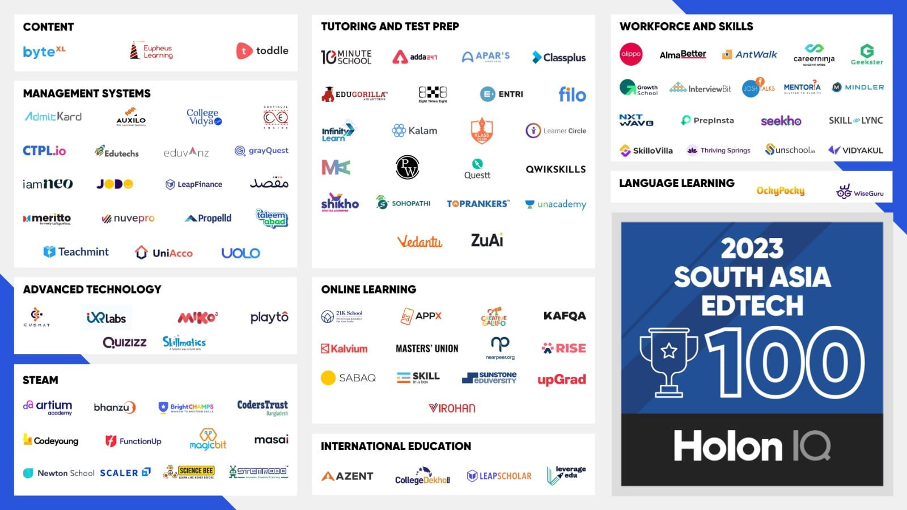

Dhaka, Bangladesh

In Holon IQ’s latest report published in November, CodersTrust has secured its position among South Asia’s Top 100 EdTech companies. The report, focusing on growth, innovation, and impact, identifies the most promising EdTech startups in the region.

Mr. Aziz Ahmad, Co-Founder and Chairman of CodersTrust, commented on this recognition, stating, ‘This acknowledgment coincides with CodersTrust’s triple-digit growth phase and serves as validation for our potential and impact in skill development, especially for youth, women, and underprivileged communities globally. The CodersTrust team remains dedicated to amplifying our social impact on a global scale through a sustainable, market-based business model.’

Since its inception in 2014, CodersTrust has provided training to over 90,000 youth and professionals across 15+ countries, focusing on in-demand skills for the Digital Economy. Notably, 30% of the beneficiaries are women. Renowned global and local organizations such as the Government of Bangladesh-GoB, World Bank, UNDP, WFP, DANIDA, Rockefeller Foundation, Save the Children, Porticus, BRAC, PKSF, iDE, CARE and GrameenPhone trust CodersTrust for skill-oriented training and workforce development.
