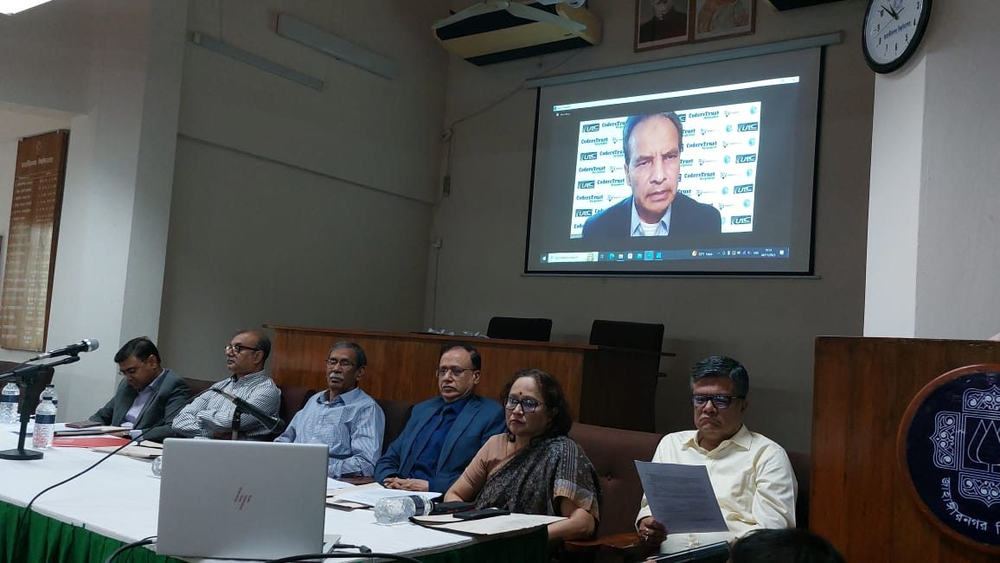

Dhaka, Bangladesh

CodersTrust Chairman Mr. Aziz Ahmad virtually joined at the Memorandum of Understanding (MoU) signing ceremony that took place between Jahangirnagar University Institute of IT and the ICT Division of DoICT, Ministry of ICT. A workshop on ‘Envisioning Future Bangladesh’ and the inauguration of Freelancing Training supported by CodersTrust was also organized alongside the event held on November 04 (Saturday) at the senate hall of Jahangirnagar University.

“CodersTrust is thrilled about this mutually beneficial collaboration between Jahangirnagar University and the ICT Division, DoICT,” said Aziz Ahmad. He extended his gratitude to all the guests and stakeholders at this pivotal event and emphasized the importance of such a partnership.

CodersTrust is actively engaged in providing training to the Bangladeshi population, particularly the youth, and takes pride in contributing to this national endeavor, he said.

Mr. Ahmad underlined the significance of developing IT skill sets in the competitive job market of the global economy and highlighted the necessity of upskilling Bangladeshi youth in the context of the Fourth Industrial Revolution. In today’s fast-evolving technological landscape, STEM students must continually reskill themselves, and CodersTrust plays a significant role there, he pointed out.

“CodersTrust is committed to the vision of a Smart Bangladesh within 2041, championed by the honorable Prime Minister Sheikh Hasina,” he said.

Technology and entrepreneurship are pivotal aspects of the Prime Minister’s master plan for Smart Bangladesh, and CodersTrust’s years of experience in these domains make it a relevant and trusted partner, Mr. Ahmad added.

He concluded his speech by expressing his appreciation for the initiative and the ICT Ministry’s decision to involve CodersTrust as a training partner in this journey. He highlighted the necessity of focusing on advanced technologies such as artificial intelligence, data science, and machine learning to ensure that Bangladesh remains competitive on the global stage.
