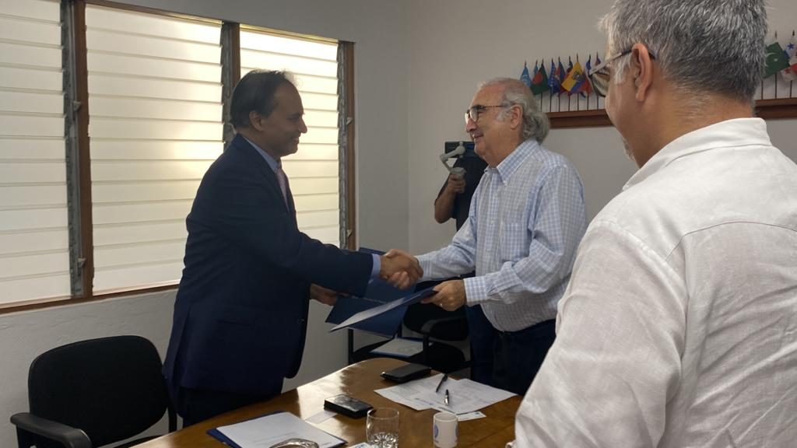

Global EdTech company CodersTrust and the University for Peace, an university and treaty organization mandated by UN General Assembly, have forged a partnership on Saturday June 3rd, at a signing ceremony held at UPEACE campus in San Jose, Costa Rica, to offer Next Generation Skills training for the Digital Era through academic collaboration and student exchanges.

Aziz Ahmad, Chairman of CodersTrust and Professor Francisco Rojas Aravena, Rector of University for Peace signed the agreement. Dr. Juan Carlos Sainz Borgo, Vice Rector of University for Peace and Md. Shamsul Haque, CEO of CodersTrust was present among others.

UPEACE Rector Professor Francisco Rojas Aravena praised CodersTrust for its focus on youths and women from underprivileged, underserved and underemployed backgrounds. Emphasizing on innovation for peace, Professor Aravena said next-generation skills and technologies like Artificial Intelligence should be leveraged for the peace and prosperity of humanity, addressing any concerns. He recalled his visit to Bangladesh and termed its relationship with Bangladesh as permanent.

CodersTrust Chairman Aziz Ahmad said, this affiliation holds great significance in relation to world peace, education, job opportunities, and women empowerment. He said, in today’s world where technology is rapidly advancing, digital skills have become essential for socio-economic progress. He pointed out, $17 trillion will be lost due to setbacks of educational attainment during the pandemic, 1 billion youth are entering the labour market this decade with risk of un/under-employment and 45% of the workforce will need to reskilling every 3-4 years.

Mr. Ahmad underscored the need for training the youth on advanced IT skills that can contribute to world peace by helping address some of the global challenges that threaten human security and well-being, such as poverty, inequality, climate change, health, and education.

The signing ceremony was followed by a roundtable discussion on Human Rights and Peacebuilding in the Digital Age, where Aziz Ahmad spoke as a panellist. Other panellists included Juan Carlos Sainz-Borgo, Vice Rector, UPEACE, Melissa Mannis, Special Advisor, UPEACE, Dr. Mariateresa Garrido, Doctoral Coordinator, UPEACE, Giannina Segnini, Director, Master of Data Journalism, Columbia University, Branka Panic, Founding Director, AI for Peace, Fabin Solis of Abogado Aguilar Castillo Love, Marina Meira, Head of Projects, Data Privacy Brazil Research Association, Marcela Chacon, VP and Global Director for United Nations Relations, Dan O’Bryan, CEO of Roco Plants and Natalia Porras, Director of Foreign Trade of Ministry of Foreign Trade, Costa Rica Government.

## About CodersTrust

CodersTrust is a global digital workforce development company. With the power of EdTech, CodersTrust mission is to transform underprivileged, disadvantaged, and marginalized communities – especially youth and women – with skills for the Digital Era and connect them with work opportunities to enable financial independence and economic growth at a global scale. CodersTrust has developed a sustainable and scalable market-based model for providing skill-focused training to youth worldwide, resulting in employment, upward social mobility and durable social impact.

## About University for Peace

The University for Peace (UPEACE) is an international graduate-only university and intergovernmental organization, established as a treaty organization by the United Nations General Assembly in 1980. Its chartered mission is to provide humanity with an international institution of higher education for peace with the aim of promoting among all human beings the spirit of understanding, tolerance and peaceful coexistence, to stimulate cooperation among peoples and to help lessen obstacles and threats to world peace and progress, in keeping with the noble aspirations proclaimed in the Charter of the United Nations.
