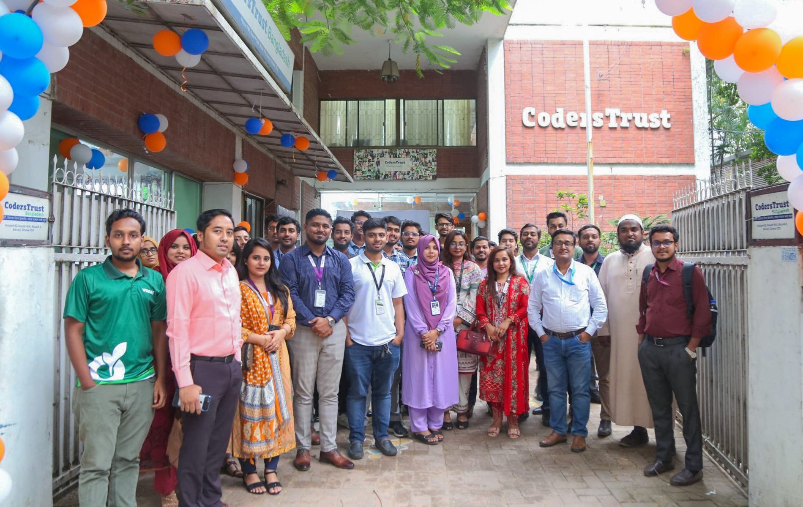

CodersTrust recently organized a ‘Career Carnival’ at its head office in Banani, Dhaka. The event aimed to provide unique job placement opportunities for its students and alumni. The Chairman of CodersTrust, Mr. Aziz Ahmed, inaugurated the event virtually from New York, USA.

Around 20 prominent companies, including Bdjobs, Priyo Shop, Technosoft, and House of Bookkeepers, participated in the event, offering over 60 job openings in fields such as Web Development, Accounts Management, Graphics Design, Digital Marketing, SEO, and Content Writing. The event saw an overwhelming response, with more than 1,000 students and alumni attending in person.

For the past decade, CodersTrust has been dedicated to solving Bangladesh’s unemployment issue by developing skilled manpower focused on digital competencies. The organization’s approach blends concept-based education with practical assignments and projects, ensuring that students are equipped with both knowledge and hands-on experience. Graduates also benefit from job-placement support through CodersTrust’s extensive network of partner companies.

A representative from Priyo Shop remarked, “In most job applications, we see many qualifications listed, but the candidates often lack the specific skills needed. CodersTrust’s direct job placement system, tied to their skill-based courses, greatly helps companies like us find the right talent.”

Junaid, an alumnus of CodersTrust’s digital marketing course, shared his experience: “I completed the digital marketing course last year and now work in Facebook marketing. Today, I had two interviews for SEO Specialist and Digital Marketing roles, and submitted my CV to another company. This event gave me hope, and it was wonderful to reconnect with mentors and fellow coursemates.”

CodersTrust is a global EdTech-based digital workforce development and skill-oriented education provider. It has trained 130,000+ youth since 2014 across 15 countries and territories, and 1.5M+ National University learners are being onboarded. Its programs range from K-12 STEM, coding, and robotics to professional skills and advanced technology skills for the digital era.
