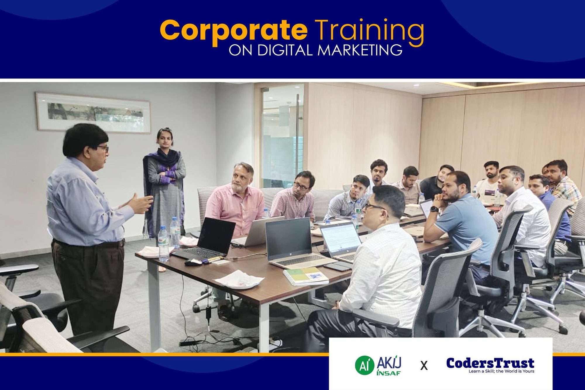
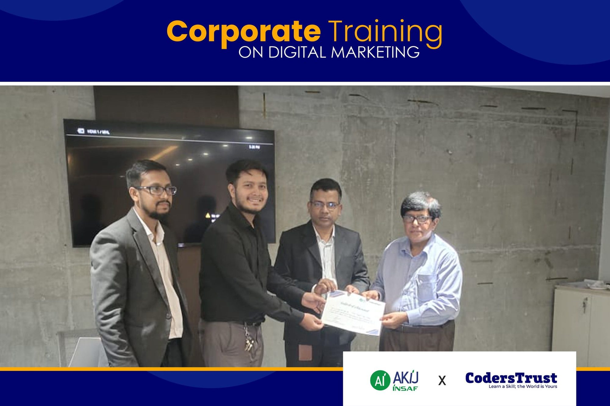

## Akij Group receives training on Modern Corporate Skills, Digital Marketing and Soft Skills

Dhaka, Bangladesh

CodersTrust has conducted a corporate training on digital marketing and soft skills for [Akij Group of Companies](https://akij.net/), a $14 billion conglomerate based in Bangladesh. The event concluded with a certificate presentation to the talented participants in presence of high officials of Akij Group and Md. Shamsul Haque, CEO of CodersTrust Bangladesh and former Additional Foreign Secretary of the Ministry of Foreign Affairs of Government of Bangladesh.

The collaborative training session aimed to equip Akij Group’s employees with the latest insights and strategies in the field of digital marketing. In today’s fast-paced business landscape, digital marketing is a critical skill for organizations looking to stay competitive and engage with their target audience effectively.

The training covered a wide range of topics, including social media marketing, search engine optimization (SEO), content marketing, email marketing, and digital marketing analytics. Participants had the opportunity to learn from experts and gain hands-on experience through practical exercises and case studies.

Akij Group’s Head of HR and Chief Marketing Officer expressed gratitude to CodersTrust for delivering the training. He highlighted the significance of upskilling the workforce to adapt to the rapidly evolving digital landscape and stressed the company’s commitment to nurturing talent within the organization.

Md. Shamsul Haque, CEO of CodersTrust Bangladesh, congratulated the participants for their hard work and enthusiasm throughout the training. He emphasized the importance of digital marketing skills in the modern business landscape and commended Akij Group for their forward-thinking approach to investing in employee development.

The collaboration between CodersTrust and Akij Group showcases a shared commitment to promoting digital literacy and professional development within Bangladesh’s corporate sector. By providing employees with the tools and knowledge needed to excel in digital marketing, such corporate trainings not only benefits the individuals involved but also contributes to the growth and competitiveness of the companies in the digital economy.
