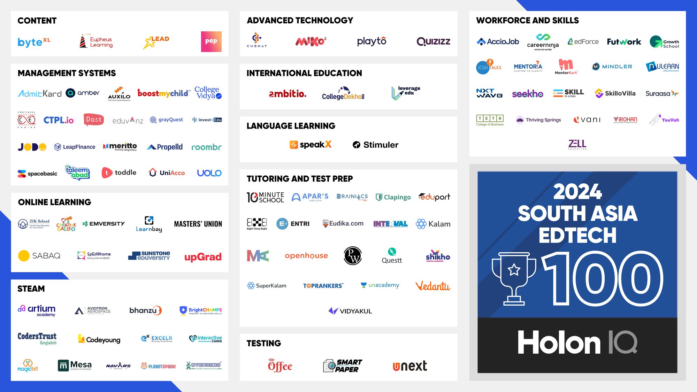

CodersTrust, a global EdTech company with its headquarters in NYC, announced it has been honored as one of the most dynamic and innovative EdTech startups in HolonIQ’s 2024 South Asia EdTech 100. This prestigious recognition highlights CodersTrust’s contributions to transforming education, empowering learners, and bridging the skills gap in South Asia’s fast-evolving workforce.

***Note: This marks the second time CodersTrust has made the prestigious list.***

The HolonIQ South Asia EdTech 100 recognizes trailblazing organizations across the region that are redefining how people learn, teach, and upskill in today’s digital-first economy. CodersTrust earned its place alongside other prominent companies such as NxtWave, Virohan, and Zell Education, showcasing excellence in professional certification and technology-focused training.

Mr. Tuan Nguyen Anh, Founder and President of Boston Global Forum added “CodersTrust is playing a critical role in building the nation’s future by empowering learners to compete globally. Their focus on digital skills aligns with our vision of transforming Bangladesh into a skilled and innovative economy. We are proud to see CodersTrust recognized on an international stage.

This year’s spotlight on workforce and skills solutions underscores the surging demand for qualified talent in technology, finance, healthcare, and soft skills. CodersTrust, with its direct-to-consumer approach, continues to cater to a diverse audience through its robust portfolio of programs tailored for digital skill-building, professional certification, and career growth.

Mr. Roland Schatz, Founder and President UNGSII Foundation said “CodersTrust’s inclusion in the 2024 South Asia EdTech 100 reflects the company’s innovation in workforce development and its significant role in equipping learners with in-demand skills. South Asia continues to be a hub of EdTech growth, and organizations like CodersTrust are driving that transformation.”

“Being recognized in HolonIQ’s South Asia EdTech 100 is a testament to our mission of empowering learners with the tools and skills to succeed in the modern workforce,” said Aziz Ahmad, Co Founder of CodersTrust. “This recognition inspires us to continue pushing the boundaries of accessible and impactful education and to help more individuals unlock their potential in the digital economy.”
