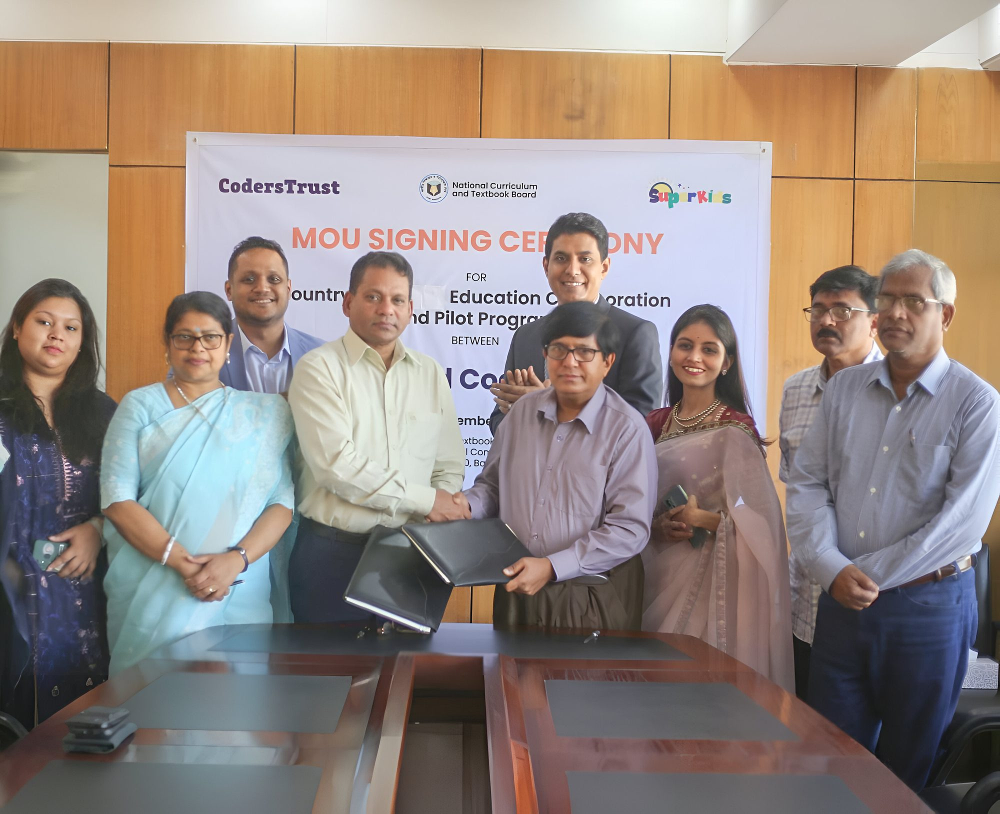
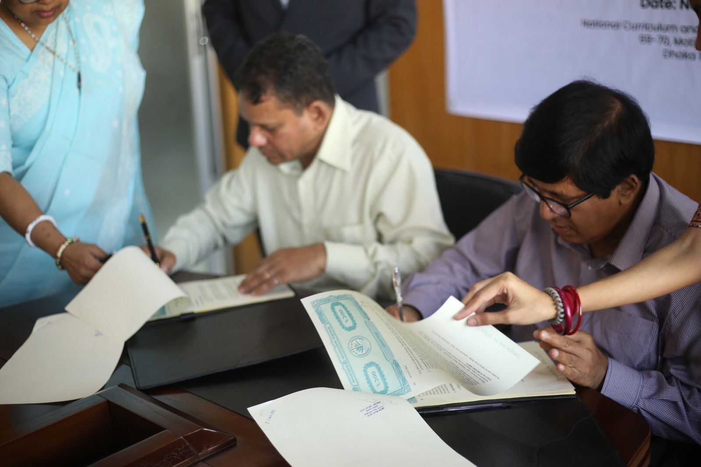
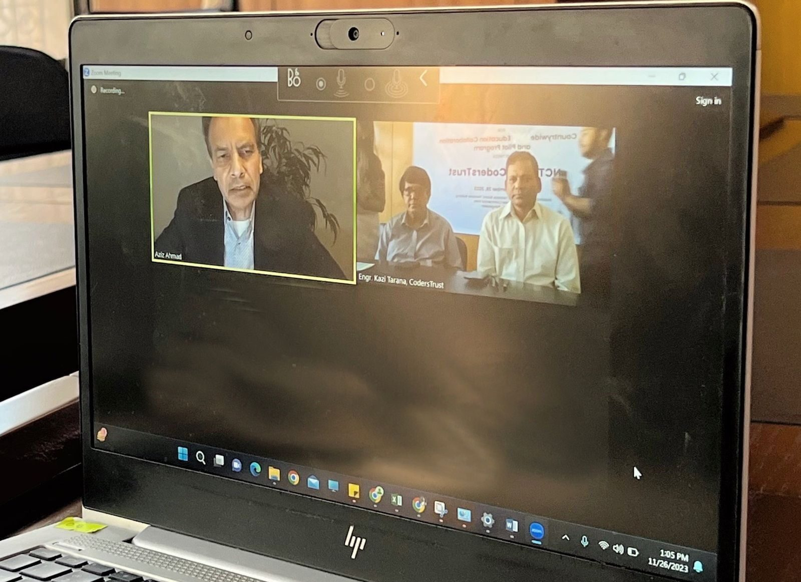
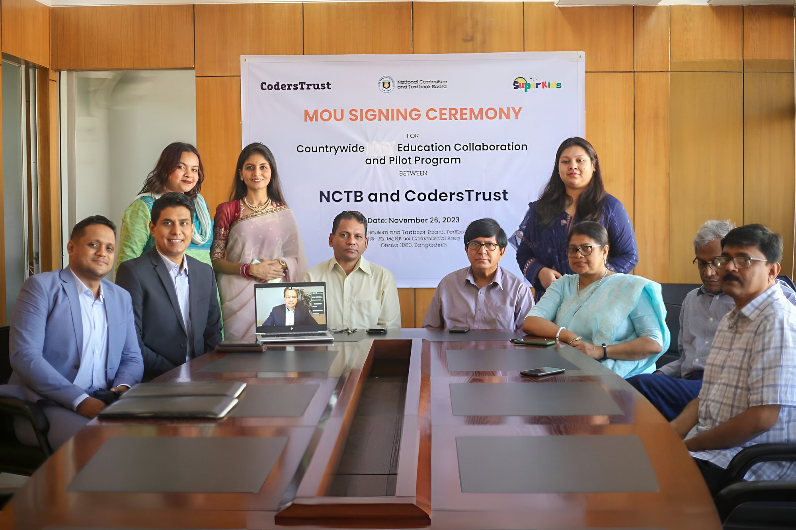

## CodersTrust and Bangladesh’s National Curriculum and Textbook Board forge a Partnership to develop World-Class Competency-based Experiential Learning Programs for 25 million Students Countrywide.

Dhaka, Bangladesh

CodersTrust will collaborate with NCTB to further revolutionize the education system with world-class competency-based, experiential, and hands-on learning across Robotics, Coding, Math, Science, Digital Technology, and ICT-related education.

CodersTrust inked a groundbreaking agreement with the esteemed National Curriculum and Textbook Board (NCTB), the apex body of curriculum and textbook development in Bangladesh on November 26, 2023, at the NCTB office. Under the agreement, CodersTrust and NCTB will collaborate to transform Bangladesh’s primary and secondary level students with competency-based experiential learning and skills to meet the demands of local and global employment markets facing unprecedented changes in the ongoing Fourth Industrial Revolution. This partnership represents a significant stride towards developing a tech-savvy, skill-equipped generation to fulfill the Smart Bangladesh Vision 2041.

Prof. Md. Farhadul Islam, Chairman of NCTB and CodersTrust CEO Md. Shamsul Haque signed the document in the presence of Prof. Md. Mukhlesur Rahman, Member, NCTB (Primary Wing), CodersTrust Chairman Aziz Ahmad, Moss. Nazma Akhter, Secretary, NCTB, and Ataul Gani Osmani, Country Director of CodersTrust.

Expressing optimism, Prof. Md. Farhadul Islam highlighted the necessity of technology-based learning to realize the “Smart Bangladesh” vision. He hoped the collaboration with CodersTrust would be a significant step towards that goal. “The concept of competency-based experiential learning is still new to both students and teachers in Bangladesh and I hope CodersTrust will work jointly with NCTB to prepare the educators to deliver the learning experience on advanced competencies like robotics and coding — a crucial step for the success of the new curriculum being rolled out,” he said.

CodersTrust Chairman Aziz Ahmad expressed gratitude for the collaboration and emphasized the goals and benefits to the country this partnership will result in. “This agreement is a transformative leap, establishing a solid foundation for the future generation in the realms of competency-based education for today’s in-demand skills,” he said. He lauded NCTB’s efforts in offering modern learning methods and pedagogy to the students in Bangladesh. He underscored CodersTrust’s unwavering commitment to impact-driven results, emphasizing the value of hands-on learning experiences.

Under the collaboration, CodersTrust will provide comprehensive training to school teachers for effective delivery of education on advanced competencies like robotics and jointly develop learning programs and countrywide pilots for hands-on, experiential learning, following NCTB’s well-developed curriculum framework, leading to learning outcomes including computational thinking, logical reasoning, algorithms, problem-solving, critical thinking, and creativity.
