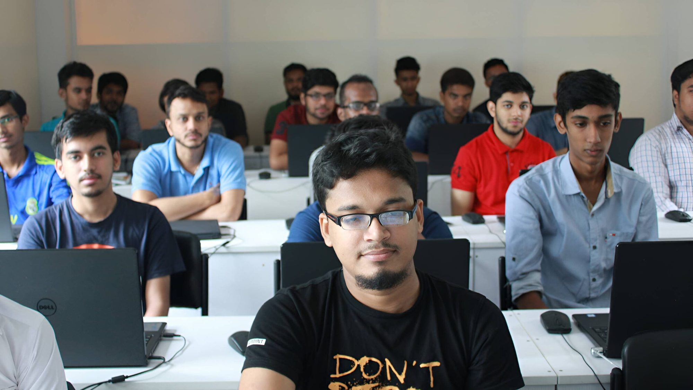

On a sunny afternoon, a student returned home from her tuition classes only to receive distressing news from her father. He informed her that due to financial difficulties resulting from business losses, he could no longer afford to support her education. Devastated by this realization, the student, who aspired to attend a private university in the capital, found herself searching for alternative solutions to fund her studies.

Amidst her search, she discovered CodersTrust, an organization offering free basic courses on data entry. Recognizing that acquiring this skill could potentially pave the way for her continued education, she seized the opportunity and enrolled without hesitation. Looking back, she reflects, “It was 2015, and I didn’t have much knowledge about freelancing at that time. But one thing I knew for sure was that if I could learn this skill, I could continue my studies.” With that determination, she embarked on her journey, and within a few years, she is now on the path to becoming a dental technician as a student at the United Care Institute of Medical Technology.

Like her, many students have found support and opportunities through CodersTrust Bangladesh, enabling them to pursue their dreams and navigate their educational journeys. CodersTrust is a multinational company and specialized platform that combines “Learn & Earn” opportunities, equipping students with globally in-demand skills to earn money online, secure employment, or advance their careers. Founded in 2014 by Aziz Ahmad, a Bangladeshi-American philanthropic business leader, and Ferdinand Kjærulff, a Danish army captain, CodersTrust Bangladesh aims to provide a platform for professional courses and skill development.

As a Global Skill Development Institute, CodersTrust collaborates with international development agencies such as UNDP, the World Bank, Danida, and the Dutch Foundation. It has successfully implemented various projects in 11 countries, including India, Malaysia, Poland, Kosovo, and Kenya. In Dhaka, CodersTrust Bangladesh stands as the only and largest international skill development institute, with four branches and a dedicated team of approximately 120 core members working tirelessly to support students.

The organization offers over 20 different professional courses, both on-campus and online, throughout Bangladesh. Popular courses include Graphic Design, Responsive Web Design, Digital Marketing, Accounts Management System, Content Writing, Advanced Excel, Facebook Marketing, and Web Development. CodersTrust welcomes students, graduates, jobholders, housewives, and retirees who are interested in expanding their skill set. Moreover, it conducts numerous free courses throughout the year in partnership with NGOs and organizations, aiming to empower individuals through skill development.

In summary, CodersTrust Bangladesh has emerged as a beacon of hope for individuals like this student, providing them with the necessary tools and opportunities to overcome financial obstacles and pursue their educational aspirations. By offering professional courses, fostering skill development, and creating avenues for online earning, CodersTrust is transforming lives and empowering individuals to build successful careers in the digital age.
