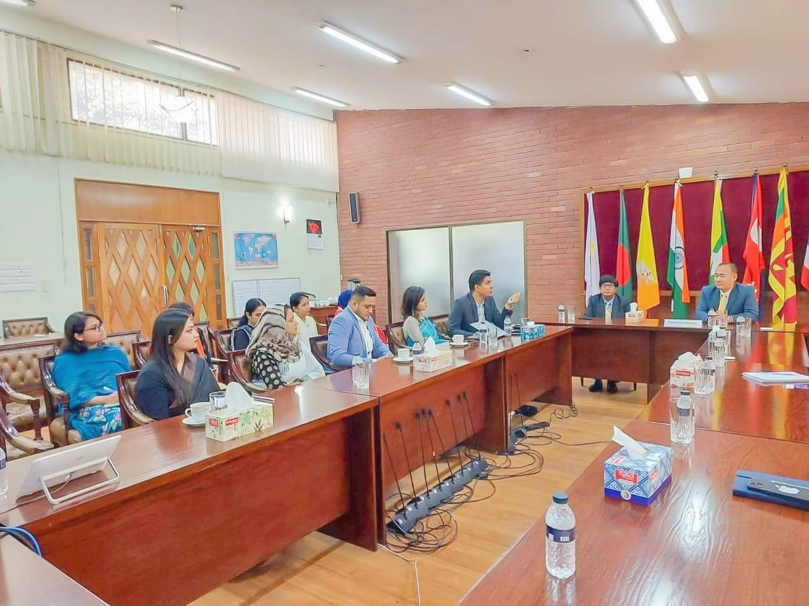

A delegation from CodersTrust, led by the CEO and Country Director, recently visited the Secretariat of the Bay of Bengal Initiative for Multi-Sectoral Technical and Economic Cooperation (BIMSTEC) in Dhaka. The delegation had a productive meeting with the Secretary General of BIMSTEC, H.E. Tenzin Lekphel, and his team. The purpose of the visit was to discuss potential collaboration between CodersTrust and BIMSTEC under the theme of “Peoples to Peoples Contacts,” with a specific focus on promoting Science, Technology, and Innovation Cooperation among the BIMSTEC member countries.

During the meeting, the CodersTrust delegation provided an overview of their organization and highlighted the valuable contributions they could make to the BIMSTEC process. CodersTrust expressed their interest in actively participating in initiatives that enhance cooperation and exchange in the field of Science, Technology, and Innovation among the BIMSTEC members.

BIMSTEC consists of Bangladesh, Bhutan, India, Myanmar, Nepal, Sri Lanka, and Thailand, representing a combined population of 1.5 billion people, which accounts for approximately 21% of the world population. These countries also have a combined GDP of over US$2.5 trillion. The potential for collaboration and mutual benefits in the areas of Science, Technology, and Innovation among these nations is significant.

CodersTrust aims to contribute its expertise and resources to strengthen the cooperative framework within BIMSTEC. By leveraging their experience in the technology and innovation sectors, CodersTrust envisions fostering closer ties among the member countries and facilitating knowledge exchange to drive socio-economic development in the region.

The meeting between CodersTrust and BIMSTEC signifies a promising step towards enhancing collaboration and leveraging the collective potential of the member countries. As BIMSTEC continues to promote regional integration and cooperation, CodersTrust’s participation in fostering Science, Technology, and Innovation Cooperation can play a crucial role in unlocking new opportunities and driving progress in the Bay of Bengal region.
