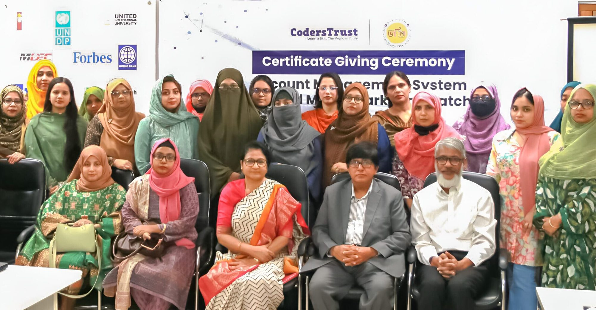
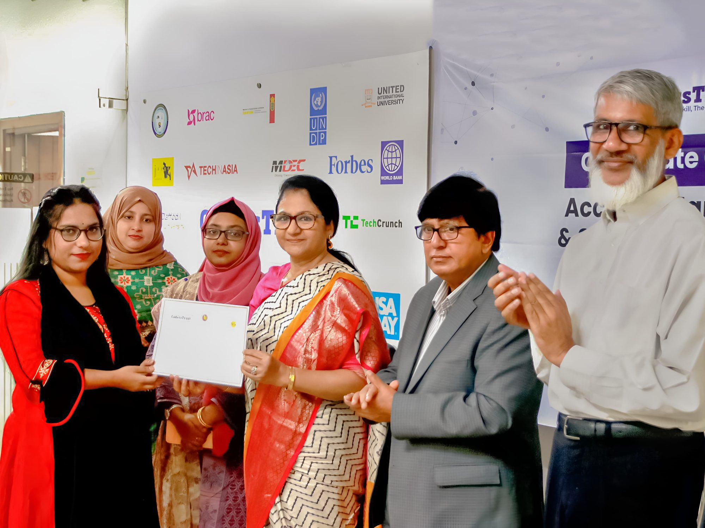
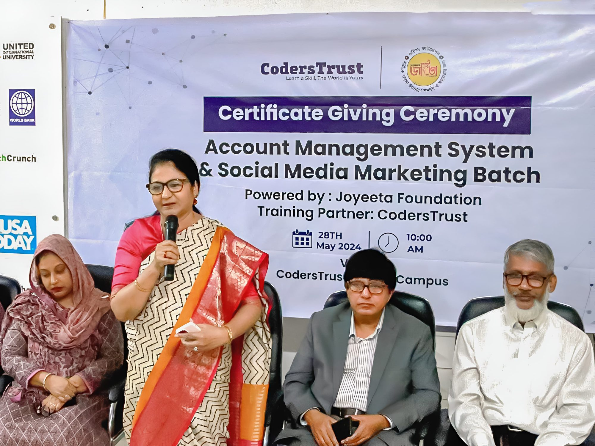
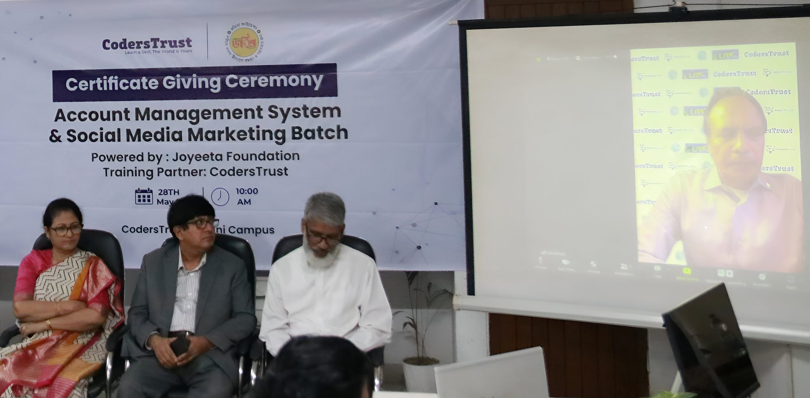
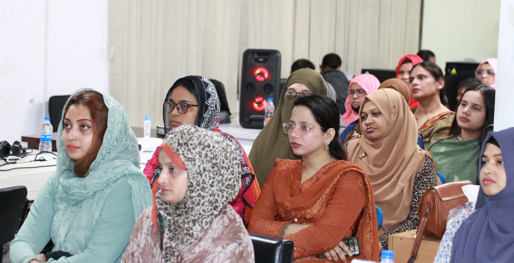

Dhaka, Bangladesh

On May 28, 2023, CodersTrust, in collaboration with the Joyeeta Foundation, celebrated a significant milestone with a certificate-giving ceremony and graduation event for women who have completed advanced training in social media marketing and accounts management systems. This initiative aims to empower women through advanced training and education.

Ms. Afroza Khan, Managing Director of the Joyeeta Foundation and former Secretary to the Bangladesh government, expressed her gratitude during the event. She praised CodersTrust’s unwavering commitment to creating a brighter, more inclusive future. Ms. Khan emphasized the crucial role women will play in the Smart Bangladesh initiative, noting that CodersTrust’s innovative methodologies and dedicated mentorship are equipping graduates with essential skills for success in the digital economy.

Aziz Ahmad, Chairman of CodersTrust, joined the event virtually from Geneva, Switzerland. He celebrated the graduates and highlighted the importance of this initiative in fostering a more equitable and technologically advanced Bangladesh. “This collaboration marks a significant step towards a more equitable and technologically advanced Bangladesh. Thank you to everyone involved, especially the Joyeeta Foundation, for making this possible!” he said.

CodersTrust is a global EdTech-based workforce development and skill-oriented education provider currently serving over 1.5 million learners and professionals and 2300+ academic institutions in 15+ countries covering K-12 STEM, coding, and robotics to professional skills and advanced technology skills for the digital era.

CodersTrust’s mission is to transform underprivileged, disadvantaged, and marginalized communities, especially youth and women, into skilled professionals and connect them with work opportunities to enable financial independence and economic growth on a global scale. CodersTrust has developed a sustainable and scalable market-based model for providing skill-focused training to millions of youths worldwide, resulting in employment, upward social mobility, and durable social impact.
