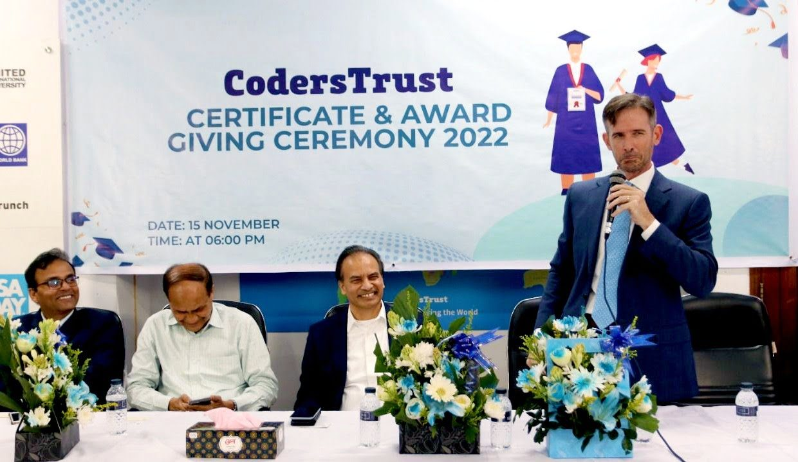

James Gardiner, the Economic Officer, responsible for technology issues at the US Embassy, highlighted the importance of continuous education, skill development, and access to US digital platforms for Bangladeshi professionals working in the ICT industry. He shared this insight during the Certificate and Award Giving Ceremony organized by CodersTrust at their Banani main office on Tuesday, according to a press release.

The ceremony celebrated the achievements of approximately 150 trainees who had recently completed their training at CodersTrust, as they received their well-deserved certificates.

Distinguished guests in attendance included Aziz Ahmad, Founder and Chairman of CodersTrust; Dr. Abdul Karim, former principal secretary to the prime minister and adviser of CodersTrust; Nazrul Islam Khan, former secretary of the prime minister’s office, ICT Division, and ministry of education and adviser of CodersTrust; Bikarna Kumar Ghosh, Managing Director of Bangladesh Hi-Tech Park; and Professor Dr. Md. Nasiruddin Mitul, Dean of National University.

The esteemed guests commended CodersTrust for its significant contributions in producing highly skilled human resources in Bangladesh and successfully placing them in the global job market. They emphasized the crucial role of developing the younger generation into skilled professionals, recognizing the success stories generated by CodersTrust in this regard.

James Gardiner’s remarks underscored the importance of skill development and access to US digital platforms as key factors in empowering Bangladeshi ICT professionals to thrive in the industry. By emphasizing continuous learning and exposure to global digital platforms, Gardiner highlighted the opportunities for Bangladeshi professionals to enhance their skills and expand their career prospects.

The ceremony served as a platform to recognize the achievements of the trainees while reinforcing the significance of skill development and access to international digital platforms in the ever-evolving ICT landscape. CodersTrust continues to play a crucial role in shaping highly skilled human resources in Bangladesh and connecting them with global employment opportunities.
