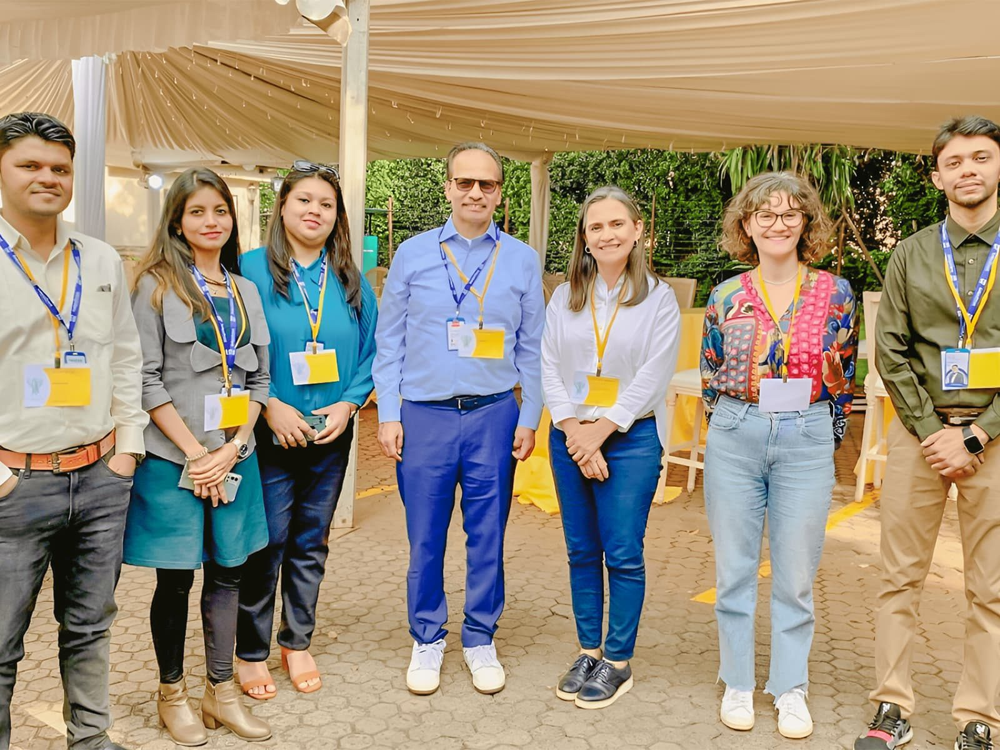

## CodersTrust creates digital spaces that actively contribute to building and sustaining harmony by transforming conflicts on a global scale

Nairobi, Kenya

CodersTrust, a leading global EdTech company, in technology-driven social impact, was honored to participate in the “Build Peace 2023 Conference” held in Nairobi, Kenya, invited by the University for Peace. CodersTrust Chairman, Aziz Ahmad, led a six-member team to engage in discussions centered around the design of online spaces for conflict resolution and transformation.

The conference brought together global experts and practitioners to explore the application of conflict transformation skills in digital environments. The primary focus was on creating inclusive online spaces that effectively de-escalate and transform conflicts, with a particular emphasis on underrepresented identities.

Team CodersTrust, actively contributed to workshops alongside peers from around the world. Together, they collaboratively developed digital spaces dedicated to interpersonal and intergroup conflict mediation and de-escalation.

CodersTrust’s dedication to change positively through technology was evident not only in their insightful workshop, “Designing Online Spaces for Conflict Transformation,” but also in interactive sessions engaging attendees globally. Mr. Ahmad, along with Kazi Tarana, Head of Project Management and Business Communication, took the stage as key speakers, showcasing CodersTrust’s innovative platform fostering meaningful conversations, empathy, and unity across cultural divides.

The workshop featured real-world case studies highlighting CodersTrust’s use of socio-technology to bridge gaps between communities, empower marginalized voices, and foster understanding between nations. This commitment to leveraging connectivity extends beyond the conference, as CodersTrust actively seeks partnerships and collaborations to contribute to a more peaceful world. By embracing diversity, building bridges through digital spaces, and harnessing the potential of cross-cultural public-private partnerships, Mr. Aziz invites everyone to join them in creating a more harmonious future. “Building bridges across cultures takes more than code—it requires collective will. Change doesn’t just sprout in Silicon Valley; it’s found in every connected corner of the globe. Let’s join hands globally, tap into collective wisdom, and forge a more peaceful digital landscape for a better future together.” he says.

CodersTrust envisions leveraging top-notch content and cutting-edge training programs to equip the next generation as formidable contenders in the global marketplace. Their active involvement in the “Build Peace 2023 Conference” reaffirms their commitment to making a positive impact on a global scale.
