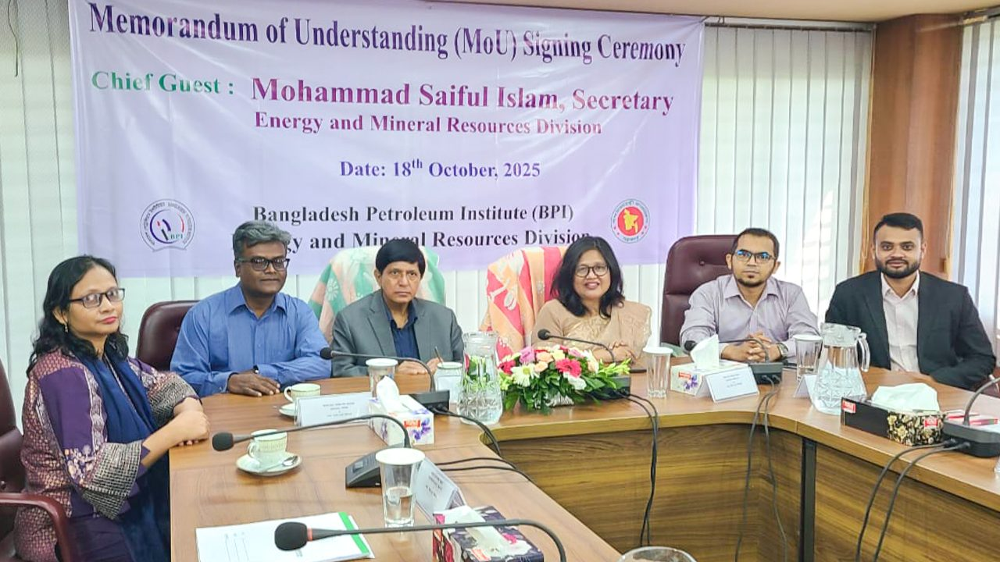
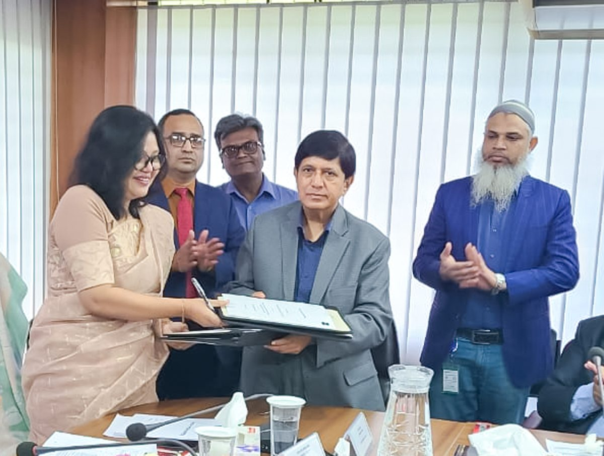
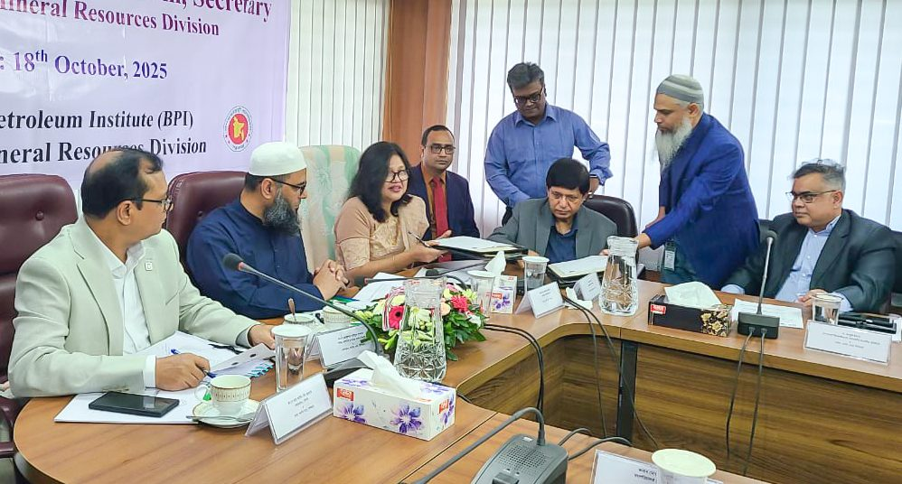

Bangladesh Petroleum Institute (BPI) and CodersTrust Bangladesh have signed a Memorandum of Understanding (MoU) to enhance capacity building and digital skills development within the energy sector.

The signing ceremony was held on October 18, 2025, in the presence of Mr. Mohammad Saiful Islam, Secretary of the Energy and Mineral Resources Division, who attended as the Chief Guest. Mr. Khen Chan, Director General of the Bangladesh Petroleum Institute, presided over the event as Chairman.

The partnership aims to strengthen professional competencies, promote technology-driven innovation, and expand opportunities for advanced training across the energy industry. Through this collaboration, both institutions intend to facilitate knowledge sharing, support workforce development, and contribute to sustainable growth in the sector.
