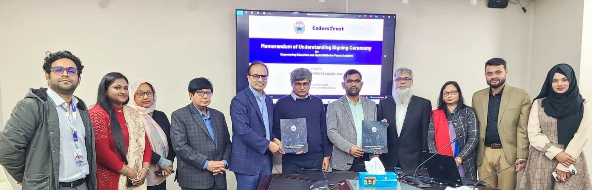
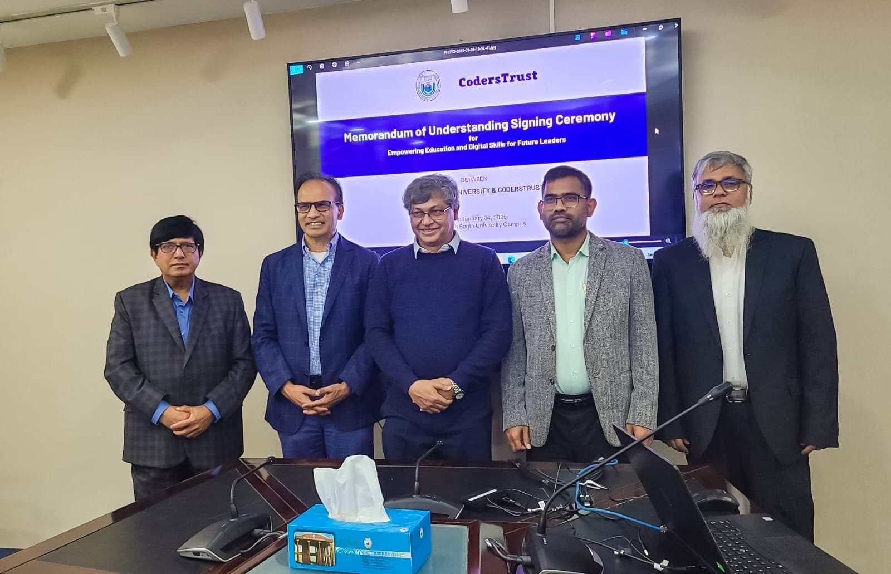
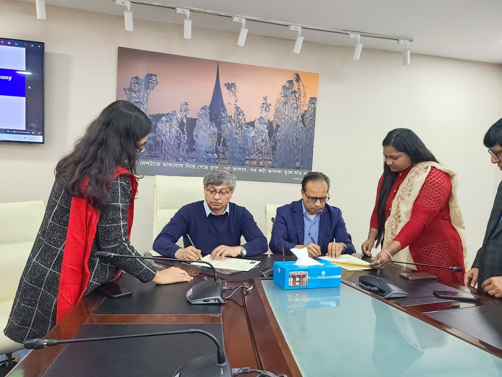

We are proud to announce the signing of a Memorandum of Understanding (MoU) between North South University (NSU) and CodersTrust. MoU signed by Professor Abdul Hannan Chowdhury, Vice Chancellor, North South University & Chairman, Grameen Bank and Aziz Ahmad, Chairman & Co-Founder, CodersTrust.

The ceremony was witnessed and attended by Dr. Shazzad Hosain, Dean of North South University, and Mr. Md. Shamsul Haque, CEO of CodersTrust, along with Mr. Md. Iqbal Hassan Ferdous (CRO), Ms. Shamama Naushin Yamani (Director), Ms. Mahzabin Akter, Ms. Sajeda Akter Happy, among others.

This partnership aims to empower youth through cutting-edge skill development programs, equipping them with the tools to thrive in the global digital workforce. Together, we are committed to building a sustainable economic foundation both locally and globally.

This collaboration holds immense potential to advance digital skills development, create impactful career pathways for students, and strengthen Bangladesh’s position in the global knowledge-based economy.
