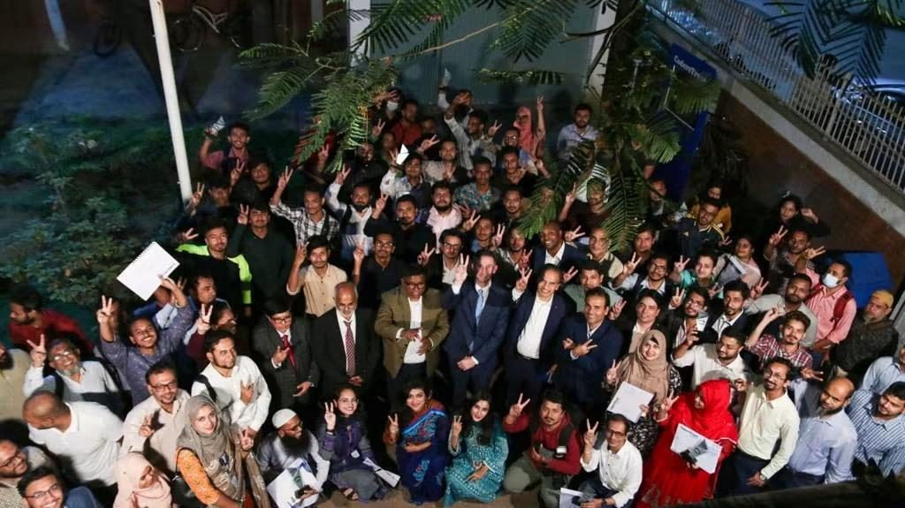
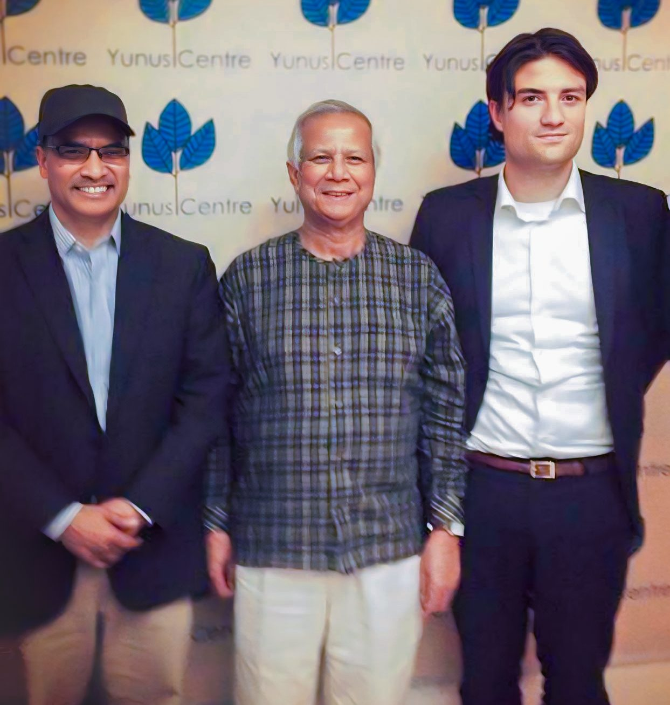
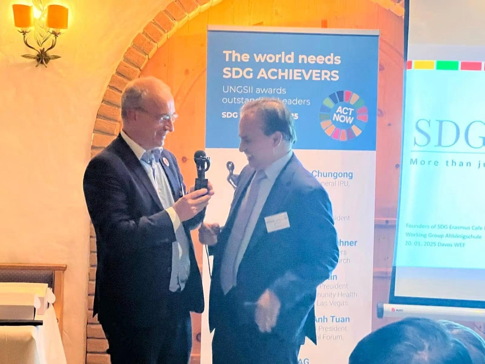

Bangladesh’s greatest natural resource is not beneath the ground, it is in the minds of its young people. Every year, millions of educated youth enter the workforce with talent, ambition, and determination, yet too many remain unemployed or underemployed not because they lack ability, but because they lack access to the digital skills, global networks, and opportunities required by today’s knowledge economy.

At CodersTrust, we believe this challenge represents Bangladesh’s greatest opportunity.

Our vision is to transform Bangladesh into a Digital Factory not a factory of buildings and machines, but a nationwide ecosystem that manufactures knowledge, innovation, and globally competitive talent. By embedding ICT, Artificial Intelligence (AI), cybersecurity, cloud computing, software development, data science, digital marketing, and other future-ready skills into every district, town, and village, we can unlock the full potential of our young generation.

In this Digital Factory, every skilled young person becomes a creator of value. Rather than leaving home in search of opportunity, they can build world-class careers, serve international clients, launch innovative businesses, develop AI-powered solutions, and generate foreign income from wherever they live. Together, millions of digitally skilled Bangladeshis can transform the country into one of the world’s leading exporters of knowledge, technology, and digital services.

For decades, developing countries exported (unskilled) labour. We believe the future belongs to nations that export knowledge, expertise, innovation, and digital services. Bangladesh has every ingredient needed to become a global leader in the digital economy if we invest in the right skills and empower our youth.

As CodersTrust Co-Founder and Global Chairman Aziz Ahmad often says:

“Learn a skill, the world is yours.”

This is more than a slogan. It is a roadmap for national transformation.

Our mission is to ensure that every motivated young person regardless of geography, gender, or economic background has access to world-class digital education and the opportunity to compete in the global marketplace. We envision a Bangladesh where every community contributes to the digital economy, where entrepreneurship flourishes, where AI accelerates innovation, and where human capital becomes the country’s greatest competitive advantage.

The Digital Factory is not about manufacturing products. It is about manufacturing opportunity. It is about equipping millions of young people with the skills to compete globally, create prosperity locally, and build a stronger Bangladesh for generations to come.

The future of Bangladesh will not be defined by what lies beneath its soil, but by what exists within the minds of its people.

Let’s make Bangladesh a Digital Factory empowering millions of skilled minds to build, innovate, and compete with the world.
